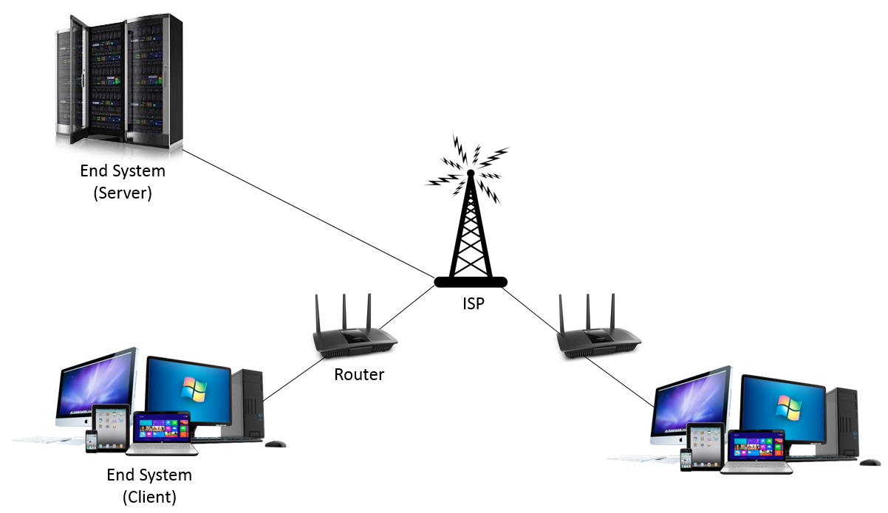
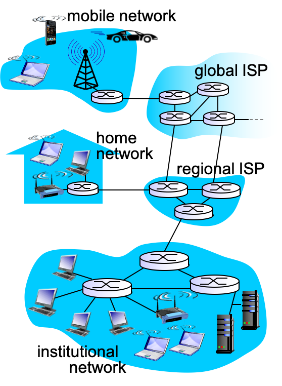
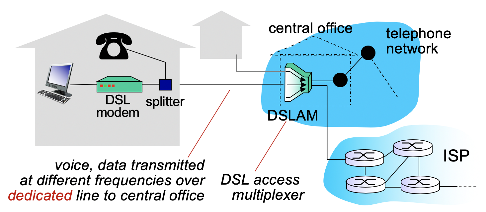
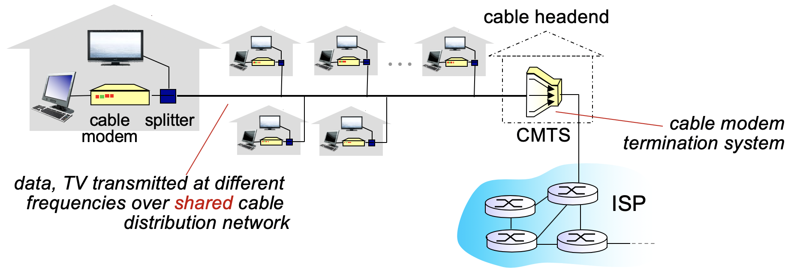
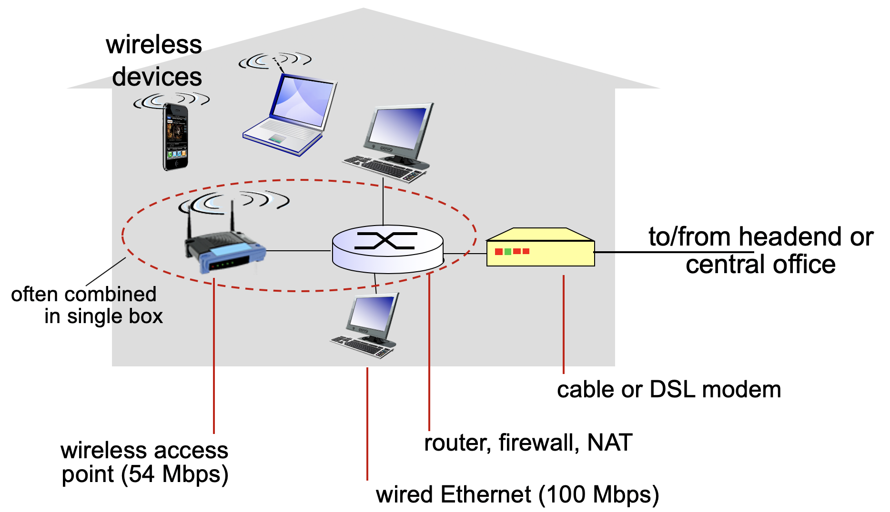
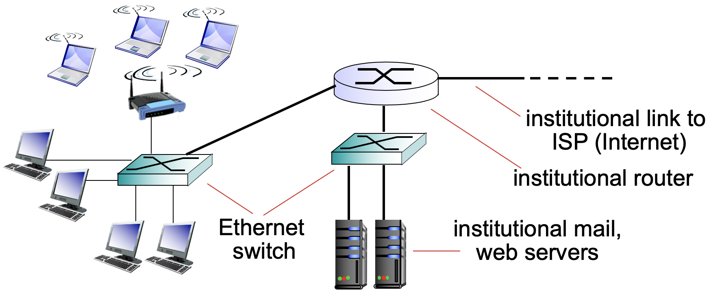
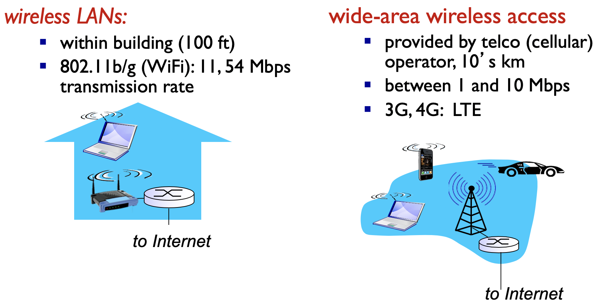

<!-- omit in toc -->
## 목차
- [1. 강좌 목표](#1-강좌-목표)
- [2. TCP/IP Five Layer Model](#2-tcpip-five-layer-model)
- [3. 인터넷이란?](#3-인터넷이란)
  - [3.1 인터넷의 구성요소](#31-인터넷의-구성요소)
- [4. 프로토콜이란?](#4-프로토콜이란)
  - [4.1 표준화가 중요하다.](#41-표준화가-중요하다)
  - [4.2 프로토콜 구성 3요소](#42-프로토콜-구성-3요소)
- [5. Access network (AN)](#5-access-network-an)
  - [5.1 Access net: Digital Subscriber Line (DSL)](#51-access-net-digital-subscriber-line-dsl)
  - [5.2 Access net: Cable network](#52-access-net-cable-network)
  - [5.3 Access net: home network](#53-access-net-home-network)
  - [5.4 Enterprise access networks](#54-enterprise-access-networks)
  - [5.5 Wireless access networks](#55-wireless-access-networks)
    - [5.5.1 Wi-Fi](#551-wi-fi)
    - [5.5.2 Cellular network](#552-cellular-network)
  - [5.6 Access network 정리](#56-access-network-정리)

## 1. 강좌 목표

- 컴퓨터 네트워크의 계층적인 프로토콜 구조 이해
- **인터넷**에서 사용되고 있는 **application, transport protocol, routing algorithm과 protocol**에 대하여 집중적으로 학습
- 네트워크의 자원 활용율을 높이고 사용자에 대한 서비스를 향상시킬 수 있는 네트워크 프로토콜 설계 및 분석 능력을 배양
  
## 2. TCP/IP Five Layer Model

이번 강좌에서는 **application layer / transport layer / network layer**를 공부할 예정이다.
## 3. 인터넷이란?
### 3.1 인터넷의 구성요소

인터넷을 하나의 덩어리로 생각했을 때 

- **Host(=End system)**: 
    - 사용자 컴퓨터나 서버를 말한다.
    - 인터넷의 가장자리에 위치해 있다. 
    - 일반적으로 컴퓨터이지만 네트워크에 연결된 전자기기들도 될 수 있다. 
    - **어플리케이션을 실행**하고 있어 host라 부른다. 혹은 네트워크 가장자리에 위치해 있어 end system이라고 부르기도 한다.
- **Router(=Switch)**:
  - 네트워크 중앙에 위치한 특수한 컴퓨터.
  - **사용자의 메세지를 목적지까지 찾아갈 수 있도록 해준다.**
- **Communication Link**:
  - **Host-router / router-router를 연결시켜준다.**

인터넷을 '네트워크들의 네트워크'라고 할 수 있다.

## 4. 프로토콜이란?
복수의 컴퓨터 사이나 중앙 컴퓨터와 단말기 사이에서 데이터 통신을 원활하게 하기 위해 필요한 **통신 규약**.

### 4.1 표준화가 중요하다.
- IETF(Internet Engineering Task Force): 인터넷 프로토콜 표준화 기관
- RFC(Request for Comments): IETF에서 발행하는 표준안. 
  - [RFC 1](https://www.rfc-editor.org/rfc/rfc1.txt)
  - [RFC 883: DNS](https://www.rfc-editor.org/rfc/rfc883.txt)

### 4.2 프로토콜 구성 3요소
- **구문(Syntax)**: 데이터를 어떻게 구성할 것인지에 대한 **형식, 부호화 방법, 신호 레벨** 등에 대한 형식을 규정한다. 
    > Format
- **의미(semantic)**: 데이터에 대하여 **구체적으로 어떻게 제어할 것인지에 대한 처리 방법과 에러가 발생했을 때 어떻게 처리할 것**인가에 대한 정보를 포함한다. 
    > Actions taken on msg transmission, receipt 
- **타이밍(timing)**: 통신이 이루어질 때 데이터를 주고 받을 **속도**에 대한 조절과 여러 데이터가 동시에 통신을 해야 할 경우에 **순서** 관리를 위한 기법이 포함된다. 
    > Order of msgs sent and received among network entities

## 5. Access network (AN)
Host들이 **access network**를 통해 인터넷에 연결된다. 

Access network 특징짓는 기준
- Bandwidth(=transmission rate, bits per second, bps): 인터넷 속도
- Shared / Dedicated (e.g Wi-fi는 shared)

KT, SKT, 케이블 회사 등의 회사가 access network를 제공해주는 회사이다.

### 5.1 Access net: Digital Subscriber Line (DSL)

- DSL: **전화회사**(e.g KT, SKT)에서 제공해주는 access network.
- DSLAM(DSL access multiplexer): 각 집에서 들어오는 신호들을 multiplex해준다.
  > multiplexing: method by which multiple analog or digital signals are combined into one signal over a shared medium.
- 기존 전화회선을 이용해서 네트워크와 연결한다.
- 다른 집과 공유되지 않는 **dedicated** line이다.
- 데이터와 음성 모두 DSL을 통해 DSLAM으로 가서 각각 인터넷, 전화 네트워크로 나뉜다.
- 24Mbps이하의 downstream, 2.5Mbps이하의 upstream을 갖는다. 

### 5.2 Access net: Cable network

- 케이블 모뎀과 컴퓨터가 연결된다.
- 케이블 tv신호와 합쳐져 케이블 회사의 CMTS와 연결된다.
  > CMTS(Cable Modem Termination System)
- 케이블 네트워크 같은 경우는 일반적으로 건물 하나당 하나씩 있어 다른 집과 공유하게 된다. 
- DSL과 다르게 **shared** link형태를 띄게 된다.
- HFC(hybrid fiber coax): 각 집과 cable headend를 잇는 **coaxial cable**과 cable headend끼리 연결하는 **fiber cable**의 조합으로 hybrid형태로 되어 있다. 
- 30Mbps이하의 downstream, 2Mbps이하의 upstream을 갖는다. 하지만 shared형태기 때문에 장단점이 있다.

> ISP: 인터넷 서비스 제공자
> 
> 한국 ISP 업체: 
> KT
> SK텔레콤
> SK브로드밴드 (+ SK브로드밴드 케이블)
> LG유플러스
> LG헬로비전
> 드림라인[B2B]
> 세종텔레콤[B2B]
> KREN
> 딜라이브[케이블]
> 현대HCN[케이블]
> CMB[케이블]
> 서경방송[케이블]
> 남인천방송[케이블]
> 푸른방송[케이블]
> 아름방송[케이블]
> CCS충북방송[케이블]
> JCN 울산중앙방송[케이블]
> 금강방송[케이블]
> 하나방송[케이블]
> KCTV 광주방송[케이블]
> KCTV 제주방송[케이블]

### 5.3 Access net: home network

- Home network의 중심에는 **router**가 있다.
- Router에 wireless access point(WAP), ethernet 등이 연결되어 있다.
  - Router와 WAP가 하나의 장비 안에 있는 경우가 많다
- Router가 headend / central office와 연결된다. 
- 네트워크 사용 기기 -> home network -> 전화/케이블회사 network -> ISP(인터넷)

### 5.4 Enterprise access networks

- 학교나 회사에는 end system들이 매우 많다. Router 하나가지고 안됨 -> **ethernet switch**를 사용
- 수많은 end system들이 **ethernet switch**들과 케이블로 연결되어 있다.
- WAP는 **ethernet switch**와 연결된다.
- **Ethernet switch**는 하나의 방/층/건물에 있는 end system들을 모두 연결시켜준다.
- 이러한 etherent switch들은 학교/회사 전체를 연결하는 **router**와 연결되어 있다.
- Router가 인터넷(ISP)에 직접 연결시켜준다. -> Dedicated line을 이용한다.
- 학교/기업은 전화/케이블 network을 거치지 않고 바로 ISP와 연결된다.
- 1Gbps, 10Gbps 

### 5.5 Wireless access networks

#### 5.5.1 Wi-Fi
- 학교/회사: End system -> WAP -> ethernet switch -> router -> ISP
- 집: End system -> WAP -> router-> DSL/cable modem -> headend/central office -> ISP
- 주로 건물 내부에서만 사용할 수 있다.
#### 5.5.2 Cellular network
- 3G,LTE 등을 통칭하는 말.
- 외부에서도 사용할 수 있다. 

### 5.6 Access network 정리
| 장소      | 설명                                                                |
| :-------- | :------------------------------------------------------------------ |
| 집        | 호스트 -> router-> DSL/cable modem -> headend/central office -> ISP |
| 학교/회사 | 호스트 -> ethernet switch -> router -> ISP                          |
