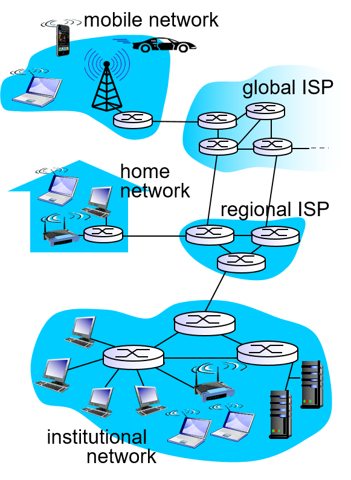
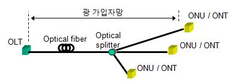
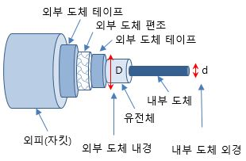
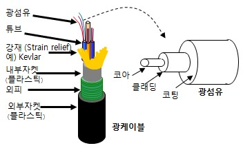
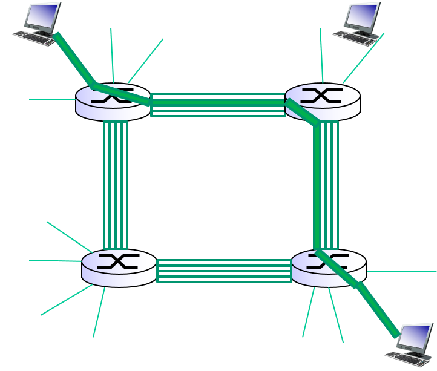
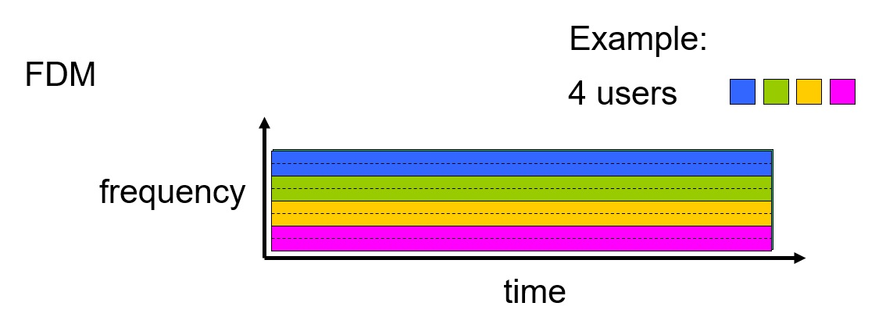
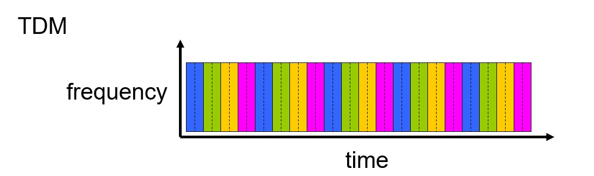
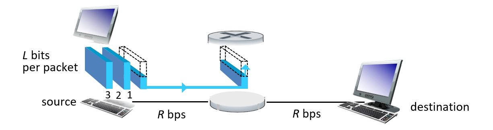
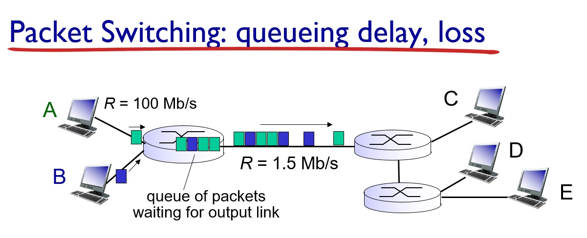
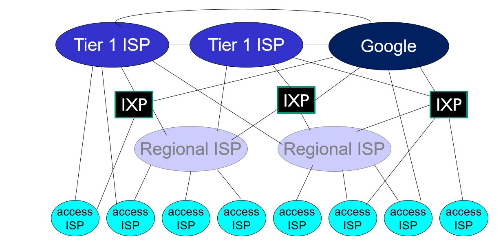

<!-- omit in toc -->
## 목차
- [1. 강좌 목표](#1-강좌-목표)
- [2. 복습](#2-복습)
  - [2.1 Network edge](#21-network-edge)
  - [2.2 Network core](#22-network-core)
  - [2.3 추가 자료](#23-추가-자료)
- [3. Why Host?](#3-why-host)
- [4. Physical Media](#4-physical-media)
  - [4.1 Guided Media](#41-guided-media)
  - [4.2 Unguided Media](#42-unguided-media)
- [5. Network Core](#5-network-core)
  - [5.1 Circuit Switching](#51-circuit-switching)
    - [5.1.1 FDM (Frequency Division Multiplexing)](#511-fdm-frequency-division-multiplexing)
    - [5.1.2 TDM (Time Division Multiplexing)](#512-tdm-time-division-multiplexing)
    - [5.1.3 WDM (Wavelength Division Multiplexing)](#513-wdm-wavelength-division-multiplexing)
  - [5.2 Packet Switching](#52-packet-switching)
    - [5.2.1 Store and Forwarding](#521-store-and-forwarding)
    - [5.2.2 Queueing delay](#522-queueing-delay)
  - [5.3 비교](#53-비교)
- [6. Internet Structures](#6-internet-structures)
  - [6.1 Network of networks](#61-network-of-networks)
  - [6.2 Tier I ISP](#62-tier-i-isp)
  - [6.3 IXP](#63-ixp)
  - [6.4 Content Provider Network](#64-content-provider-network)

## 1. 강좌 목표

- network edge, network core의 구성요소에 대해서 배운다.
- host가 access network를 통해 데이터를 전송하는 과정 이해.
- circuit switching과 packet switching의 차이 이해
- ISP, IXP, Regional ISP 등 수많은 access network가 어떻게 연결되는가 이해.
  
## 2. 복습

### 2.1 Network edge
- Network는 크게 network edge와 network core로 구분.
- Network edge로는 Host, Router, Link (Host-Router, Router-Router)가 있다. 
- Router란? ([정보통신기술용어해설 사이트] http://www.ktword.co.kr/word/index.php) : **독립적인 네트워크들을 연결**, **패킷 스위칭 가능**, **라우터끼리 상호 통신하며 경로 배정 및 제어**
### 2.2 Network core 
- Edge와 Core의 Router는 Access Network(가입자망)로 연결되어 있음. 전화회사 혹은 cable 회사가 router들을 modem으로 연결. 이더넷 스위치를 사용할 경우 Acess Network를 거치지 않고 direct로 인터넷과 연결
- Core는 router들이 복잡하게 연결된 덩어리(ISP)들이 또 연결된 'Network of Networks'
### 2.3 추가 자료
- FTTH(Fiber to the Home) : 전화국에서 가입자 선로 전부를 광케이블 화하는 것. 
- PTP(point to point) : 1 광 케이블 / 1 가입자 
- PON(Passive Optical Network) : 케이블을 다수의 가입자가 공유. 수동소자만을 사용. 전송거리가 길다 (xDLS 4km, PON 10~20km)
 

## 3. Why Host?
- Network application을 실행(host)해서 **Host**이다!
- 이로 인해 application message가 발생. 얘네를 작은 packet들로 쪼개서 전송하더라. 
- 추가적으로 통신가능한 노드(컴퓨터, 스위치, 라우터)를 가지고 있으며 네트워크에서 **식별 가능한** 인터페이스 주소(IPv4, IPv6)를 가져야 함. 

## 4. Physical Media
전송자와 수신자 사이의 link를 통틀어 physical link라고 함. 
### 4.1 Guided Media
- 신호가 물리적인 매체를 통해 전달되는 것. 마치 전선.
- **Twisted Pair(쌍꼬임 케이블)** : Copper로 이루어짐. 이더넷에서 사용. 케이블을 꼬아서 누화(서로 다른 채널의 신호가 결합하여 영향을 주는 것)를 감소. 
- **HFC(Hybrid Fiber/Coax)** : Fiber가 광케이블, Coax가 동축 케이블. 방송국에서 단위 셀까지는 광케이블, 단위 셀에서 가입자들까지는 동축 케이블 사용하는 방식. FTTH를 위한 중간 단계로 볼 수가 있더라.
- **표피 효과(skin effect)** : 주파수가 높아짐에 따라 전류가 도선의 바깥쪽으로 흐르려는 성질 => 저항 높아진다.
- **Coaxial Cable** : skin effect를 줄이기 위해 등장. 차폐되어 장거리 송신에 용이하다.근데 비싸다.

- **Fiber Optical Cable** : 대역폭 제한이 없다고 봐도 됨. 저렴하다. 가볍고 쉽게 휘어진다. 전기 신호가 아니라 빛이기 때문에 electromagnetic noise에 강하다. but... 전기 신호를 빛 신호를 바꿔주는 기계가 비싸다고 하더라.
- 
### 4.2 Unguided Media
- 신호가 자유롭게 전달되는 것. 전자기파.
- Radio, Wifi, Cellular
- 간섭에 취약.
- 3g: few Mbps, 4g : 10Mbps above, 5g : 4g의 100~1000배

  

## 5. Network Core
- Mesh of Router & Switch
- 이 구조를 거쳐 host가 송신한 message가 수신자에게 전달된다. 
- Message는 단위 비트 길이의 Packet으로 쪼개진다.
### 5.1 Circuit Switching
- 
- **Call Setup** : Call (이 메시지 누구한테 보낼게요)이 발생하면 어떤 경로를 사용해서 보낼지가 정해지고 그 경로의 자원이 예약이 됨. => 자원을 분할하는 기술이 필요. 
- 주로 전화에서 사용. 통화하는 동안 해당 회선은 사용자가 독점. 통화가 끝나야 다른 사용자도 사용이 가능하다.
- **회선의 사용이 비효율적!**
#### 5.1.1 FDM (Frequency Division Multiplexing)
- *Multiplexing이란?* 설비를 효율적으로 사용하기 위해 사용되는 기법을 일컫는 용어. 하나의 설비에 신호를 어떻게 결합해서 보낼까?
- => Demultiplexing : 결합된 신호를 분리하는 기술.
- FDM : 서로 다른 주파수 대역에 여러 신호를 동시에 전송
- 
#### 5.1.2 TDM (Time Division Multiplexing)
- TDM : 타임슬롯을 나누어 신호를 돌아가며 전송.
- 
#### 5.1.3 WDM (Wavelength Division Multiplexing)
- 광통신의 경우 파장대역을 할당해 신호를 전송한다고 하더라. FDM 방식의 일종인데 왜 굳이 WDM으로 새 이름을 만들었는지는 모르겠음.
### 5.2 Packet Switching
- 자원을 효율적으로 쓸 수 없을까... 고민하다가 탄생
- 1960년대에 Store and Forwarding Switching 방식의 네트워크를 미국 방성이 구축. 현재 인터넷의 전신이 됨. 
#### 5.2.1 Store and Forwarding
- packet에 목적지 정보가 담겨 있다. 그래서 라우터는 **해당 패킷을 다 전송받아야만** 해당 패킷의 목적지를 알 수 있고 다음으로 전송할 라우터를 결정할 수 있다.그래서 들어온 패킷을 buffer에 저장하고 에러검출을 끝낸 후 전달한다. *커피 주문받는 상황을 생각해보자. 아이스 아메리카노를 주문받을 때 '아이스'를 듣고 컵에 얼음을 넣고 '아메리카노'를 듣고 아메리카노를 넣으면 더 빠르게 만들 수 있는데 얘네는 '아이스 아메리카노'를 다 듣고 나서야 얼음을 넣는다는거다. 그리고 멀티태스킹이 안 돼서 커피를 만들면서 다음 주문을 못 받는다. 그래서 저장되었던 패킷을 전부 전달해야만 다음 패킷을 받아들일 수 있다.* 
- 

#### 5.2.2 Queueing delay
- 하나의 패킷의 길이가 L-bit, Transmission rate이 R-bps 이면 최소 2L/R의 delay가 발생한다.
- 자원을 예약을 해놓지 않기 때문에 해당 라우터를 사용하려는 패킷이 계속해서 쌓인다. 어디에? buffer에.
- *Buffer란?* 라우터 또는 스위치에서 해당 장치를 통해 전달되기를 기다리는 패킷들이 큐를 이루어 보관되는 장소.
- *Buffering* 인터넷 연결이 원활하지 않아 데이터 수신 속도가 느려 buffer에 패킷이 쌓이는 속도보다 패킷을 읽는 속도가 빠르면 buffer가 비워지게 된다. buffer가 다시 찰때까지 대기 상태에 빠지는데 이것이 흔히 얘기하는 버퍼링 현상이더라~
- Buffer도 물리적인 장치이기 때문에 저장할 수 있는 패킷의 양이 한정되어 있다. 이 한계를 넘어서면 loss가 생긴다. 이것을 **Congestion**이라고 하더라.
- 
### 5.3 비교
- 

## 6. Internet Structures
### 6.1 Network of networks
- 
- host는 ISP(Internet service provider)에 의해 연결된다. 이 ISP는 계층적인 구조를 가지고 있고 같은 계층끼리 연결되기도 한다. 
- *예시 : 모든 서울대학교 학생들이 서로의 번호를 알고싶다. 모든 사람이 1대1로 번호를 교환할 수도 있지만... 대장 행정실 번호를 학생들한테 주고 행정실에 전화해 특정 학생의 번호를 물어보면 알려주는 것이 효율적이다!*
### 6.2 Tier I ISP
- 그런데 이렇게 global ISP 하나 있는 것은 여러 이해관계 때문에 현실적으로 불가. 그래서 대형 ISP인 Tier I ISP들이 있고 얘네가 서로 연결되어 있다 (peering Link). 
- *예시 : 대장 행정실이 업무량이 많아서 단과대 행정실한테 업무를 돌렸다. a 학과 학생이 b 학과 학생의 번호를 알고 싶으면 a 학과 행정실이 b 학과 행정실에 물어봐서 알아낸다.*
### 6.3 IXP
- IXP (Internet exchange point) : 인터넷 교환 노드. Network Access point라고도 불림. 
- 효율적인 접속을 위해 ISP끼리 연결하는 것.
- *예시 : 대장 행정실이 새로운 업무를 받음. 다른 학교와의 연결. 서울대학교 대장 행정실은 중앙대학교 대장 행정실과 연결되어 있다. 그래서 서울대학교 a학과 학생이 중앙대학교 b학과 학생의 번호를 알고 싶으면... 서울대학교 a학과 행정실 -> 서울대학교 대장 행정실 -> 중앙대학교 대장 행정실 -> 중앙대학교 b학과 행정실을 거쳐 번호를 알게 되는 것이다. 그런데 서울대학교 a학과와 b학과의 교류가 잦아 서울대학교 a학과 행정실과 중앙대학교 b학과 행정실이 direct로 연결을 해버림. 이것이 IXP.* 
- 두 개의 ISP가 여러 link로 연결될 수도 있음. traffic이 많을 때 다른 link를 사용하면 되기 때문에. 여러개의 higher-ISP 가지는 것을 Multi-home이라고 하더라.
### 6.4 Content Provider Network 
- 연결을 하고 ISP를 사용하는 것도 전부 돈임. 그래서 사용자가 많은 google 같은 애들은 이 돈을 내느니 내가 만들겠다 해서 자기만의 네트워크를 만듦. 이것이 Content Provider Netwokr
- Content Provider는 콘텐츠르 소유, 판매할 수 있는 라이센스를 가지는 사업자이다. 
- 독자적인 data center들을 연결. 사용자들과 어떻게 연결되는가? 최대한 low-Tier ISP와 연결해서 (저렴하기 때문에)
- *예시 : A 회사는 자기 회사 홍보를 하고 싶다. 그래서 서울대학교 학생들의 번호를 얻는 조건으로 서울대학교 대장 행정실에 큰 돈을 지불했다. 그런데 A 회사는 주로 전기과 학생만을 채용한다. 그래서 더 싼 값에 전기과 행정실과 새롭게 계약을 맺었다.* 