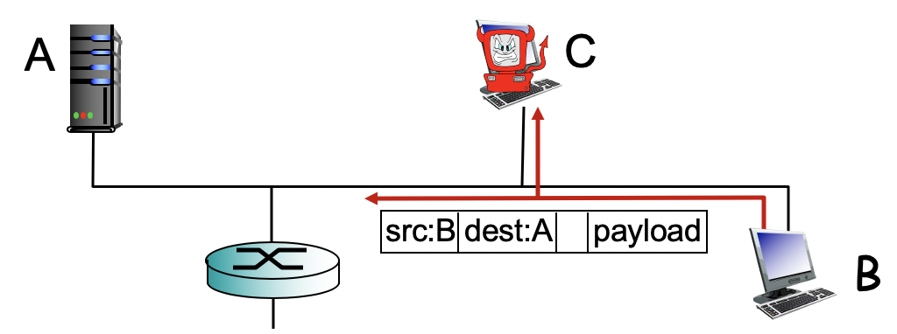

<!-- omit in toc -->
## 목차
- [1. Four Sources of Packet Delay](#1-four-sources-of-packet-delay)
- [2. Packet Loss](#2-packet-loss)
- [3. Throughput](#3-throughput)
- [4. Why Layering?](#4-why-layering)
- [5. Internet Protocol Stack](#5-internet-protocol-stack)
- [6. Network Security](#6-network-security)
- [7. Internet History](#7-internet-history)

## 1. Four Sources of Packet Delay

- **Processing delay**
  - 문제 없이 잘 왔나. **에러 확인**
  - 다음 **어디로 갈지** 정해준다. Determine output link.
  - 일반적으로 msec 이하
- **Queueing delay**
  - **버퍼에서 기다리는 시간**
  - 다른 delay와 다르게, **네트워크 상황에 따라 가변적**이다. 
  - L: packet length (bits)
  - R: link bandwidth (bits/sec, bps)
  - a: average packet arrival rate
  - La/R: traffic intensity (L*a: 단위시간당 유입되는 traffic의 양)
    - 
    - La/R ~ 0: avgerage queueing delay small
    - La/R > 1: average queueing delay large
    - 위 그래프에서 La/R이 0.7 부근에서 급격히 증가하는 것을 볼 수 있는데, avg가 0.7이라는 말은 1 이상인 경우가 종종 발생한다는 의미기 때문에 이로 인하여 delay가 급격히 증가한다.
- **Transmission delay**
  - **패킷을 링크에 밀어넣는데 걸리는 시간**
  - 
  - L: packet length (bits)
  - R: link bandwidth (bits/sec, bps)
- **Propagation delay**
  - **패킷이 전파되는데 걸리는 시간**
  - 
  - d: length of physical link
  - s: propagation speed in medium(~)

## 2. Packet Loss

- Outgoing link를 바로 사용할 수 없을 때, queue에 쌓이게 된다. Queue는 유한한 용량을 갖고 있기 때문에 queue가 모두 차게 되면 **packet loss**가 발생하게 된다.
- 잃어버린 패킷을 제대로 보내기 위해선 *재전송*을 해야하고 이는 **딜레이의 증가**(사용자입장)와 **리소스의 낭비**(네트워크입장)가 발생한다.
## 3. Throughput
- **단위시간당 source로부터 destination까지 전달한 트래픽의 양** (bits/sec)

- 트래픽이 지나가는 여러 링크 중 capacity가 제일 작은 링크의 capacity에 의해 throughput이 결정된다. -> **bottleneck link**

- 일반적으로 network core가 아닌 클라이언트, 서버의 access network(Rc, Rs)에서 bottleneck이 발생한다.

## 4. Why Layering?
프로토콜은 매우 복잡한 구조로 이루어져 있어 layering으로 구성되어 있다.
- 장점:
  - explicit structure allows **identification, relationship of complex system's pieces**
  - **유지보수, 업데이트**가 편하다. 
- 단점:
  - layer의 기능을 독립적으로 구현하다보면 **레이어끼리 중복되는 기능**이 있을 수 있다.
  - 다른 layer의 정보가 필요한 경우 **정보를 가져오는데 있어서 overhead**가 발생한다. 

## 5. Internet Protocol Stack

- **Application**
  - **FTP**(File Transfer Protocol): TCP/IP 프로토콜을 가지고 서버와 클라이언트 사이의 파일 전송을 하기 위한 프로토콜이다.
  - **SMTP**(Simple Mail Transfer Protocol): 이메일 전송에 사용되는 네트워크 프로토콜이다.
  - **HTTP**(HyperText Transfer Protocol): WWW 상에서 정보를 주고받을 수 있는 프로토콜이다. 주로 HTML 문서를 주고받는 데에 쓰인다. TCP와 UDP를 사용하며, 80번 포트를 사용한다.
  - Application에서 메시지를 만들어내고 전송은 transport layer에 부탁한다.
- **Transport**
  - Source process - destination process data transfer
  - Process - process transfer를 하기 위해 host - host transfer를 해야하는데 이는 network 계층에 부탁한다.
- **Network**
  - Source host - destination host data transfer
  - host - host transfer를 하기 위해 [hop by hop](https://en.wikipedia.org/wiki/Hop_(networking))으로 건너야하는데, 각 hop을 건너가는 일을 link layer에 부탁한다.
- **Link**
  - Hop을 건넌다.
  - Hop을 건너기 위해 data를 medium에 실어나르는 일을 physical layer에 부탁한다.
- **Physical**
  - Data를 실어나른다.
> 각 계층은 바로 아래 계층의 서비스를 이용하여 자기의 목표를 달성한다.

- Protocol Data Unit(PDU)
  - Application layer: **message**
  - Transport layer: **segment**
  - Network layer: **datagram**
  - Link layer: **frame**
- Switch는 network layer가 없어 경로를 찾는 역할을 하지 못한다.
- Header는 나의 peer(다음 destination 혹은 switch 혹은 router의 같은 계층. 위 예시에서 switch link의 peer는 router link이다.)가 읽도록 하는 것이 목적이다. 
- Transport 계층은 source와 destination간에 데이터를 잘 주고받았는지 확인한다.

## 6. Network Security
> - 공격의 종류는 무엇인지 파악하는 것
> - 어떻게 공격에 대비할 것인지 설계하는 것
> - 공격에 immune한 네트워크 시스템을 설계하는 것

- Malware
  - **Virus**: Virus를 받아 실행시켜야 작동한다.
  - **Worm**: 실행시키지 않아도 작동한다.
- Spyware malware can record keystrokes, web sites visited, upload info to collection site
- Botnet is a set of compromised computers used for spam or DDoS attacks (쓸모없는 packet등을 계속 보내면서 서버를 다운시키는 것)
- **Denial of Service (DoS)** : 트래픽을 끊임없이 보내면서 target server를 무력화시키는 것

- **Packet sniffing**: wifi나 shared ethernet에서 발생한다. End system에 NIC가 꽂혀있어서 나에게 오는 frame만 받아들이도록 설계되어있는데, NIC를 promiscuous mode로 변환시켜버리면 다른 host의 정보들까지 받아볼 수 있게된다. (promiscuous mode는 일반적으로 관리 목적으로 사용된다.)

- **IP spoofing**: 자신이 아닌 다른 사람인척하면서 source address를 바꿔 요청을 보내는 것

## 7. Internet History
10년 마다 큰 변화가 있어왔다. 자세한 내용은 아래 슬라이드 참고..

