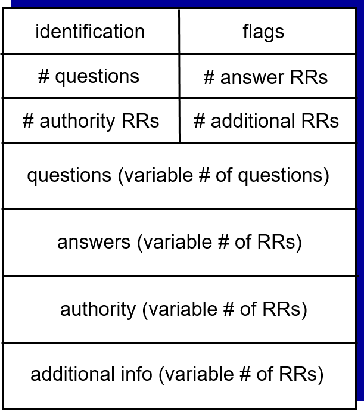
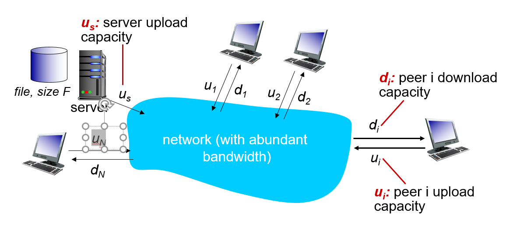
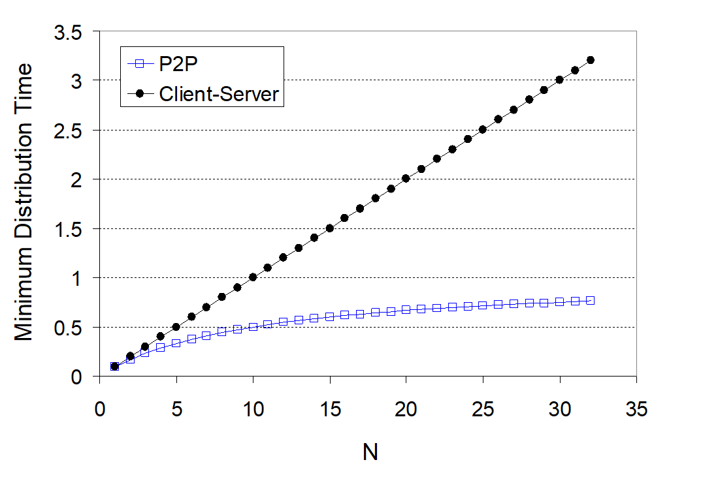
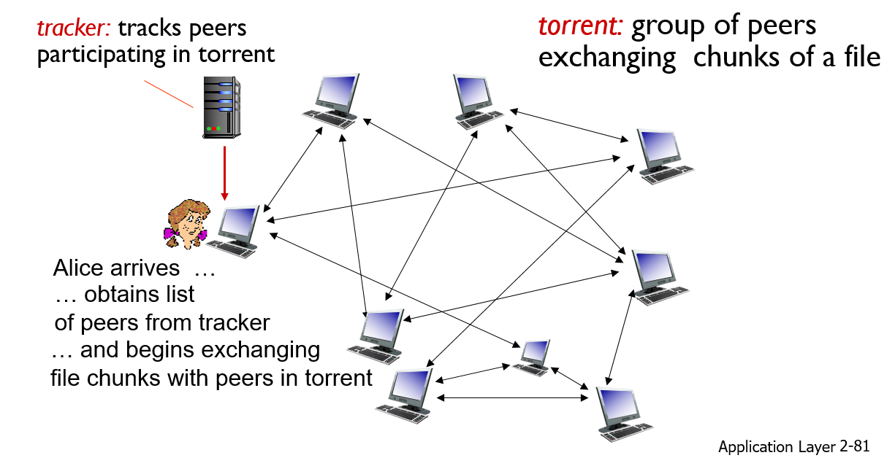

<!-- omit in toc -->
## 목차

  

## 1. 강좌 목표

- RR(resource record)의 종류와 각각의 쓰임새.
- P2P application가 가지는 장점을 수식으로 설명.
  
## 2. DNS Records
- DNS는 distributed database 가지고 이렇게 분산된 정보 각각을 Resource Record라고 한다. 하나의 RR은 name, value, type, ttl(time to live) 4개의 정보를 담고 있고 type에 따라 name, value의 의미가 달라진다. 
### 2.1 Type = A (Address record)
- name : hostname (호스트명)
- value : IP address (호스트의 IPv4 주소)
- Host의 정보가 담긴다. 
### 2.2 Type = CNAME (Canonical name)
- name : alias name (별칭 호스트명)
- value : canonical name (공식 호스트명)
- alias name은 간단하고 직관적으로 이해할 수 있는 별명 같은 것이다.
- ex) alias name : www.ibm.com  
- canonical name : servereast.backup2.ibm.com
### 2.3 Type = NS (Name Server)
- name : domain
- value : 해당 domain의 **authorative name server**의 호스트명.
### 2.4 Type = MX
- name : 메일 서버의 별칭
- value : 별칭에 대한 호스트 이름
### 2.5 기타
- SOA(Start of Authority), PTR(Pointer), HINFO(Host Information)등 존재. 위의 4개가 전부는 아님.

## 3. DNS Protocol msg

- query와 reply는 같은 형식을 띤다. query (Header + 질의) reply(Header + 질의 + 응답 + 책임 + 부가정보)
### 3.1 Header
- Identification : 16bit. 식별자로 매 질의마다 고유한 ID 생성한다. 이 식별자를 이용해 질의-응답이 연결됨.
- flag : 16bit. 해당 메시지가 질의인지 응답인지 구분. 
- 그 외에는 질의 카운트, 응답 카운트, 네임서버 카운트, 추가정보 카운트가 header를 구성.

### 3.2 Question
- 질의 파트는 질의 명과 질의 타입으로 구분.
- 질의 명(query name)에는 질의의 대상인 영역의 이름이 담긴다. 
- 질의 타입(query type)에는 RR type에서 설명한 type들이 실린다. 즉, 어떤 type의 record를 answer 받고 싶은지

### 3.3 Answer
- 각 question에 대한 응답이 실림. header에 있는 질의 카운트를 바탕으로 질의 수에 맞게 응답을 보낸다. 
  
### 3.4 authority
- Authority zone server의 NS record가 저장된다.
### 3.5 additional info
- mailserver의 이름을 물을 경우 해당 mailserver의 IP 주소를 추가로 보내준다. 질의하지는 않았지만 필요할 것 같은 정보를 첨부.

### 3.6 추가
- TTL (Time To Live) : IP 패킷의 경우 거쳐가야 할 라우터의 갯수. 라우팅 할 때마다 하니씩 줄어든다.
- DNS Caching의 TTL은 정보를 네임서버가 유지하는 시간으로 통상 2일
- networkutopia.com 을 등록하는 과정. 
1. authorative server를 사서 회사에 있는 host들을 연결. 즉, type A record를 authorative server에 저장.
2. .com 을 관리하는 DNS registrar (TLD 관리 기관)에 authorative server의 name과 IP 주소 알려줌.
3. registrar가 두 개의 정보를 자신이 관리하는 TLD server에 등록된다. authorative server의 NS와 A record.  **(networkutopia.com, dns1.networkutopia.com, NS),(dns1.networkutopia.com, 212.212.212.1, A)**
4. client가 networkutopia.com에 접속하는 과정은. local name server -> .com TLD server -> authorative server -> webserver

## 4. P2P applications
### 4.1 P2P(Peer To Peer) 복습
- always-on server가 존재하지 않고 임의로 연결된 end system들이 직접적으로 communicate하는 구조.
- 새로운 end system이 추가될 때 demand와 capability가 동시에 추가되는 scalability가 장점이다.
### 4.2 File Distribution

- **client-server vs P2P**
- Q. size가 F인 파일을 N명의 peer에게 distribute하는데 걸리는 시간은?
- Client-server : *D > max{NF/us, F/dmin}* 
- P2P           : *D > max{F/us, F/dmin, NF/( us + Sum(ui) )}*
- P2P에서 초기에 server가 한 번은 파일을 upload 해야한다는 가정. 
- N이 증가할 때 client-server는 D가 linear하게 증가. P2P는 분모도 커져서 linear하게 증가하지 않는다.
  

## 5. Bit Torrent 

- 데이터의 가장 작은 단위 bit + 급류 torrent => 인터넷이라는 급류 속에 내 소정의 데이터도 일조하겠다.
- File을 256kb 크기의 chunk로 자르고 P2P 방식을 이용해 업로드하고 다운받는 방식.
- Tracker가 peer들을 tracking해서 새로운 client는 tracker에 문의해 peer list를 받고 해당 peer들한테 chunk를 공급받고 동시에 다른 client들에게 chunk를 공급한다.
- 공급하는 peer (시드), 공급받는 peer (리치)
- "Churn" : peer가 사라지거나 공급을 멈추는 것. P2P의 문제점
- chunk를 공급받을 때는 peer가 사라질 수도 있기 때문에 가장 rare한 chunk 부터 요청한다. 
- "tit-for-tat" : churn을 방지하기 위해 chunk를 가장 많이 보내고 있는 peer에게 우선적으로 chunk를 공급하는 방식. 10초마다 상위 4명을 evaluate하고 30초마다 랜덤한 peer도 선정. 업로드와 다운로드 비율로 선정.
