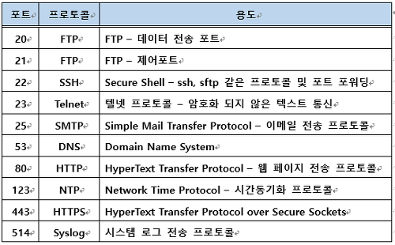
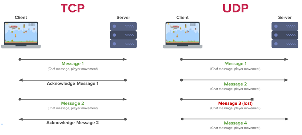

## 목차
- [목차](#목차)
- [1. Application architectures](#1-application-architectures)
  - [Socket](#socket)
  - [Addressing process](#addressing-process)
- [2. Transport service](#2-transport-service)
- [3. 인터넷에서 제공하는 transport protocol](#3-인터넷에서-제공하는-transport-protocol)
- [4. App-layer protocol](#4-app-layer-protocol)
- [HTTP -웹을 위해 만들어진 app-layer 프로토콜](#http--웹을-위해-만들어진-app-layer-프로토콜)

## 1. Application architectures

- **Client-server** 구조
  - server host:
    -  항상 on 상태
    - 영구적으로 할당된 ip 주소 사용
  - server process:
    - server host에서 진행
    - client process의 요청에 따라 응대
    - 항상 on 
  - client host:
    - 간헐적으로 인터넷에 연결되어 있다.
    - dynamic ip 주소(바뀌는 주소) 사용
    - 서버 호스트와 소통
    - cf) 원래는 client host들도 영구적으로 할당된 IP 주소를 썼었다. 그래서 페이스북의 초기 기능 중에는 하버드 기숙사의 컴퓨터 IP 주소를 모두 알아내 사용자가 어느 기숙사 몇 층 몇 호에서 접속하고 있는지를 알려주는 것이 있었다...
  - client process:
    - client host에서 진행
    - communication을 initiate

- **P2P (peer to peer)** 구조

  - 각 peer는 서비스를 제공하기도 하고 요청하기도 한다.
  - self scalability (자기 확장성): peer는 서비스 요청뿐 아니라 service capability까지 갖고 들어오기 때문에 사용자가 많아진다고 서버를 확장할 필요 없음
  - dynamic ip 주소를 가지고 있고 peer들은 간헐적으로 연결되기 때문에 관리가 힘들다.
  - server process와 client process가 둘다 한 peer 호스트 안에서 실행된다.

process: 실행중인 프로그램

### Socket

application: message 생성 후 transport 계층에 전달을 요청
transport 이하 계층부터는 운영체제의 영역

application 계층과 transport 계층 사이의 통로가 socket

### Addressing process

IP 주소로 호스트를 찾고
port number로 호스트에서 실행 중인 프로세스 중 메세지를 전달받을 프로세스를 특정한다.

well known port number

여러 클라이언트들이 request를 보낼 때 port 번호를 명시할 수 있어야 하기 때문에 port 번호를 정해두었다.

## 2. Transport service

- **data integrity**
  - 데이터가 얼마나 loss 없이 오류 없이 도착하는지
  - real time audio/video vs stored audio/video
    - stored 된 것은 버퍼링을 통해 미리 데이터를 받아놓으면 딜레이를 커버할 수 있으므로 real time보다 상대적으로 timing sensitive하지 않다.
  - file transfer같은 어플리케이션에서 필요
- **timing**
  - low delay
  - 전화, 온라인 게임 등 어플리케이션에서 필요
- **throughput**
  - 단위시간 당 전달되는 데이터의 양
  - 유튜브같은 멀티미디어 어플리케이션(시간당 60프레임은 와야 우리가 이어지는 영상으로 느낀다.)
- **security**
  - 인터넷 뱅킹같은 어플리케이션 등에서 필요

## 3. 인터넷에서 제공하는 transport protocol

- **TCP**
  - connection oriented: TCP에 전달 요청이 되면 client, server process가 연결되는 과정부터 시작된다.
  - data integrity를 보장한다.
  - flow control: 리시버의 버퍼가 오버플로우되지 않도록 조절
  - congestion control: 가운데 라우터들의 버퍼가 오버플로우되지 않도록 조절

- **UDP**
  - 네트워크 단계에서는 호스트까지만 메세지를 전달 -> 프로세스로 전달하는 역할
  - 데이터를 받으면 그냥 encapsulation해서 네트워크로 내보낸다. 
  - 오버플로우가 발생하면 라우터 자체에서 혹은 호스트에서 데이터를 다시 받는 방법이 존재한다.
- UDP와 TCP 모두 타이밍이나 보안 Throughput guarantee를 제공하지 않는다.
- 다른 transport protocol도 연구는 되었으나 tcp, udp를 보완하는 방법(멀티미디어의 발달로)이 주로 쓰일 뿐 널리 쓰인 다른 프로토콜은 없다.

- *그럼에도 UDP가 사용되는 이유*
  - 1. Protocol Overhead Control이 너무 크다. 텍스트를 한 번 전송한다 해도 hand shaking 과정, 관리하는 과정이 거추장스럽다.
  - 2. data integrity가 너무 중요해서 data의 완전성을 확인하는 과정이 application 내에 있는 경우 더 심플한 UDP를 사용한다.
  - 3. 어느 정도의 throughput이 보장되어야 하는 경우 congestion control, flow control 은 오히려 최소 throughput을 못 맞추게 할 수 있다.

## 4. App-layer protocol

 교환하는 메세지의 종류, 문법, 어떻게 해석하는지, 언제 어떤 메세지를 보내야 하는지 결정한다. 

 - OPEN protocol
   - 인터넷 표준을 적어놓은 RFC에 규약이 정의되어 있다. 따라서 호환성이 좋다.
 - Proprietary protocol
   - skype

## HTTP -웹을 위해 만들어진 app-layer 프로토콜
- hypertext transfer protocol (참고로 html은 hypertext markup language)
- base html로 이루어져 있고 jpeg, java applet, audio 등의 object의 주소를 담고 있다.

- 동작
  - client server 모델을 따르고 있다.
  - 서로 다른 브라우저(application 프로그램)에서 온 request 여도 같은 application 프로토콜을 따르고 있기 때문에 같은 서버에서 처리가 가능하다.
  - transport 서비스를 tcp에 요청한다.
    - 클라이언트가 tcp 커넥션을 initiate(소켓 생성)한 후 서버의 IP 주소에서 포트 번호 80에 컨택트해서 TCP connection 형성 
    - HTTP 메세지들을 브라우져와 웹 서버가 주고받고 connection close
  - stateless하다: 사용자가 보낸 request를 기억하지 않는다.

- non persistent HTTP
  - 최초의 HTTP
  - 커넥션 한 번에 object 하나만 전송하고 닫힘: 매우 비효율적
  -동작
  
    - 1. tcp 커넥션을 맺으면 그 커넥션의 소켓이 생성이 되고 
    - 2. http 메세지가 내려와서 서버측 소켓으로 전달
    - 3. base html이 담긴 메시지를 다시 클라이언트 쪽으로 전달 서버 쪽은 여기서 커넥션을 닫는다 
    - 4. base html을 보고 필요한 오브젝트를 요청 보냄 (jpeg 오디오 파일 등)
- persistent HTTP
  - 커넥션 한 번에 필요한 모든 object들을 다 받아온다.