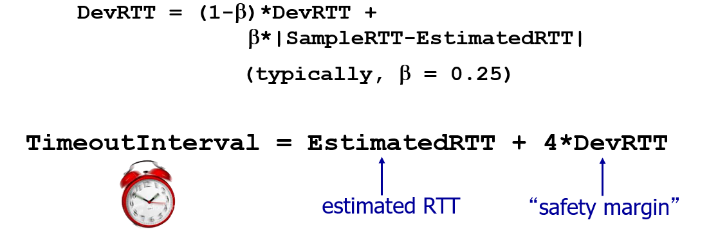
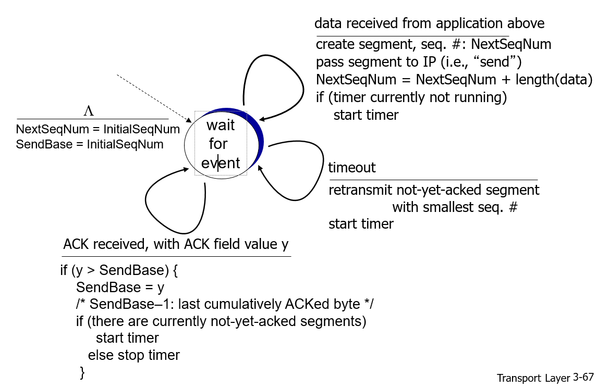

## 목차

- [목차](#목차)
- [1. 강좌 목표](#1-강좌-목표)
- [2. 복습](#2-복습)
- [3. Non-persistent HTTP](#3-non-persistent-http)
- [4. Persistent HTTP](#4-persistent-http)
- [5 Response Time](#5-response-time)
  - [5.1 RTT(Round Trip Time)](#51-rttround-trip-time)
  - [5.2 HTTP Response time](#52-http-response-time)
- [6 HTTP Requests and Responses](#6-http-requests-and-responses)
  - [6.1 HTTP Requests](#61-http-requests)
  - [6.2 HTTP Responses](#62-http-responses)
  - [6.3 HTTP Versions](#63-http-versions)

## 1. 강좌 목표
- non-persistent HTTP의 작동 원리를 이해한다.
- persistent HTTP의 작동 원리를 이해한다. 
- HTTP response status를 안다. 
  
## 2. 복습
- client-server HyperText Transfer Protocol(HTTP)를 사용해서 소통
- transport service (data integrity, timing, throughput, security)
- transport protocol (TCP, UDP)
- persistent HTTP vs non-persistent HTTP 

## 3. Non-persistent HTTP

- HTTP 1.0 
1) TCP 연결- HTTP server가 HTTP client의 connection 요청을 accept하면 server와 client에 각각 socket이 만들어진다 
    *Socket이란?* application 계층과 transport 계층 사이의 통로
2)   
                      request message(object의 URL)
        client -------------------------------------------> (socket)

3)       (socket) <------------------------------------------ server         
                        response message(object)

4) HTTP server는 TCP에게 TCP connection 연결을 끊으라고 한다 
5) HTTP client는 html 페이지를 보여주고, parsing을 통해서 추가적으로 참조하고 있는 파일을 확인한다 
- 추가적인 파일이 있다면, 위의 1~5번 과정을 계속반복

## 4. Persistent HTTP
- HTTP/1.1 
- connection을 그대로 open한 채로 둔다 
- 동일한 client로부터 추가적인 request, response message를 처리한다 

## 5 Response Time
Response time : HTTP client가 HTTP server에게 object의 url을 전송하고 HTTP server가 HTTP client에게 object를 보내고, 웹 페이지 하나를 받아오는데 걸리는 delay 시간 = (유저가 url을 입력하고 창이 뜨기까지의 시간)      

### 5.1 RTT(Round Trip Time)
- packet이 client -> server -> client로 돌아오기까지의 시간 (ms 밀리초)
  * packet이란? data(정보)를 일정 크기로 자른 것. 
- 연결의 상태를 결정하는 중요한 측정기준(네트워크 연결의 속도와 안정성 진단)
- ex) *한국의 사용자가 뉴욕 서버에 문의를 하려고 할 때, 한국 사용자의 요청은 여러 라우터로 전송되고, 뉴욕 서버가 인터넷을 통해 서울에 있는 위치로 응답을 보낸다. 이 요청이 끝나면, 두 위치 간 왕복 이동에 소요되는 시간을 대략적으로 구할 수 있다.*

### 5.2 HTTP Response time 

  * **HTTP response time** : 1 RTT(connection) + 1 RTT(request, response message) + file transmission time 
             
  * **non-persistent HTTP response time** : object 개수 x 2RTT(connection + request, response) file transmission time은 무시할 만하다고 가정      
    ex) 5개의 object? 5 * 2RTT = 10 RTT   
      * **parallel TCP connections** : delay를 피하기 위해서 object 수 만큼 tcp socket을 동시에 open한다. 동시에 request, response 전송가능. 즉 하나의 RTT가 되는 것!! 
      - TCP Connection overhead => buffer + socket 둘 다 필요 (OS가 관리)
      - *Buffer란?* 라우터 또는 스위치에서 해당 장치를 통해 전달되기를 기다리는 패킷들이 큐를 이루어 보관되는 장소.

  * **persistent HTTP response time** : 1 RTT(connection) + 1 RTT(request, response) +  1 RTT(추가적인 file들 하나의 socket으로!)      
  
  
    
## 6 HTTP Requests and Responses
### 6.1 HTTP Requests
- type : request, response 
- ASCII로 작성 
- entity body는 올수도 있고 안 올수도 있다. 
- 
- 

1) request line = <method(GET|POST|PUT|DELETE|OPTIONS|HEAD|PUT|DELETE|TRACE)> + <URL(얻고싶은 파일)> + <version(HTTP/1.0 | HTTP/1.1) >
   - URL(Universal Resource Locator) 서버에 의해서 관리되는 각 file      
     client는 서버의 host 이름(www.cmu.edu) + port(80) 사용    
     server는 파일 경로(/index.html) 사용     
     ex)       
        * static content    
         http://www.cs.cmu.edu:80/index.html         
         http://www.cs.cmu.edu/index.html        
         http://www.cs.cmu.edu         
        * dynamic content                               
        http://www.cs.cmu.edu:8000/cgi-bin/proc?15000&213  

    * HTTP methods   
  
    1. GET: static or dynamic content- url page 요청, 오직 데이터를 받음
    2. POST: form input을 담은 entity 제출
    3. HEAD: server에게 response는 보내되 요청한 object를 보내지는 않아도 됨(Get과 비슷하지만, response body에 data는 없음)
    4. PUT: 파일을 쓴다
    5. DELETE: 파일 삭제 요구
    6. CONNECT: 목적지 서버로 연결
    7. OPTION: 목적지와 통신 설정시 사용
    8. TRACE: response body에서 request를 echo한다(경로를 따라서 메세지 loop-back 테스트)
    9. PATCH: 리소스의 부분만 수정시 사용

2) request headers       
   **header name : header data**     
    request에 대한 추가적인 정보를 제공한다

### 6.2 HTTP Responses
- 
1) response line     
  **version(HTTP/1.0|HTTP/1.1) + status code(200|301|403|404) + status msg**    
    - **200 OK** error 없이 request 성공      
    - **301 Moved** 요청된 object가 이동했다는 의미-> 이동한 새로운 URL 제공    
    - **400 Bad request** request msg가 서버에서 이해되지 않는 경우
    - **403 Forbidden** file에 접근하는 허용치가 없음        
    - **404 Not found** reuqest는 문제가 없지만 server가 file을 찾을 수 없음     
    - **505 HTTP Version Not Found**  HTTP 버전을 서버가 지원할 수 없음      
  
2) response headers      
    * header name : header data      
    response에 대한 추가적인 정보를 제공한다       

### 6.3 HTTP Versions 
* HTTP/1.0 
  각 transaction 마다 새로운 connection을 사용       
  GET/POST/HEAD(서버에서 object를 요청)
* HTTP/1.1 
   persistent connection 지원.     
   GET/POST/HEAD + PUT/DELETE(URL field에 요청)
   같은 connection에 대해 여러 transaction(Connection: Keep-Alive)   
   chuncked encoding(Transfer-Encoding: chunked)

