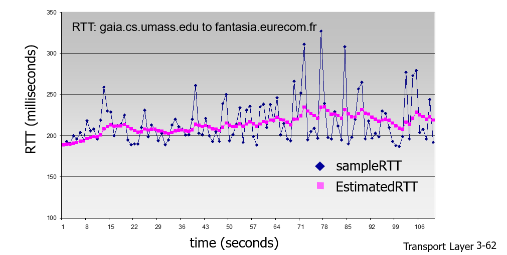
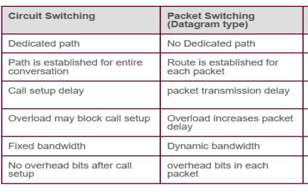

## 목차

- [목차](#목차)
- [1. 강좌 목표](#1-강좌-목표)
- [2. 복습](#2-복습)
- [3. Non-persistent HTTP](#3-non-persistent-http)
- [4. Persistent HTTP](#4-persistent-http)
- [5 Response Time](#5-response-time)
  - [5.1 RTT(Round Trip Time)](#51-rttround-trip-time)
  - [5.2 HTTP Response time](#52-http-response-time)
  - [6 HTTP request Message](#6-http-request-message)

## 1. 강좌 목표
- non-persistent HTTP의 작동 원리를 이해한다.
- persistent HTTP의 작동 원리를 이해한다. 
- HTTP response status를 안다. 
  
## 2. 복습
- client-server 구조
- transport service (data integrity, timing, throughput, security)
- transport protocol (TCP, UDP)
- persistent HTTP vs non-persistent HTTP 

## 3. Non-persistent HTTP

- HTTP 1.0 
1) TCP 연결- HTTP server가 HTTP client의 connection 요청을 accept하면 server와 client에 각각 소켓이 만들어진다 
2)   
                      request message(object의 URL)
        client -------------------------------------------> (socket)
            socket을 통해서 각 message의 전송이 이루어진다. 

3)       (socket) <------------------------------------------ server         
                        response message(object)

4) HTTP server는 TCP에게 TCP connection 연결을 끊으라고 한다 
5) HTTP client는 html 페이지를 보여주고, parsing을 통해서 추가적으로 참조하고 있는 파일을 확인한다 
- 추가적인 파일이 있다면, 위의 1~5번 과정을 계속반복

## 4. Persistent HTTP
- HTTP 1.0 이후 버전들 
- connection을 그대로 open한 채로 둔다 
- 동일한 client로부터 추가적인 request, response message를 처리한다 

## 5 Response Time
    Response time : HTTP client가 HTTP server에게 object의 url을 전송하고 HTTP server가 HTTP client에게 object를 보내고, 웹 페이지 하나를 받아오는데 걸리는 delay 시간 = (유저가 url을 입력하고 창이 뜨기까지의 시간)      

### 5.1 RTT(Round Trip Time)
- packet이 client -> server -> client로 돌아오기까지의 시간 (ms 밀리초)
  * packet : data(정보)를 일정 크기로 자른 것. 
- 연결의 상태를 결정하는 중요한 측정기준(네트워크 연결의 속도와 안정성 진단)
- ex) *한국의 사용자가 뉴욕 서버에 문의를 하려고 할 때, 한국 사용자의 요청은 여러 라우터로 전송되고, 뉴욕 서버가 인터넷을 통해 서울에 있는 위치로 응답을 보낸다. 이 요청이 끝나면, 두 위치 간 왕복 이동에 소요되는 시간을 대략적으로 구할 수 있다.*

### 5.2 HTTP Response time 

  * **HTTP response time** : 1 RTT(connection) + 1 RTT(request, response message) + file transmission time 
             
  * **non-persistent HTTP response time** : object 개수 x 2RTT(request + response) file transmission time은 무시할 만하다고 가정      
    ex) 5개의 object? 5 * 2RTT = 10 RTT     

  * **persistent HTTP response time** : 1 RTT(connection) + 1 RTT(request, response) +  1 RTT(추가적인 file들 하나의 socket으로!)      
  * 
  * **parallel TCP connections** : delay를 피하기 위해서 tcp 5개 socket을 동시에 open한다. 5개가 연달아 왔다가 연달아서 간다. 즉 하나의 RTT가 되는 것!! 
  - TCP Connection overhead => buffer + socket both needed 
  - *Buffer란?* 라우터 또는 스위치에서 해당 장치를 통해 전달되기를 기다리는 패킷들이 큐를 이루어 보관되는 장소.
    
### 6 HTTP request Message
- 2개 type : request, response 
- ASCII로 작성 
  - 

- 

