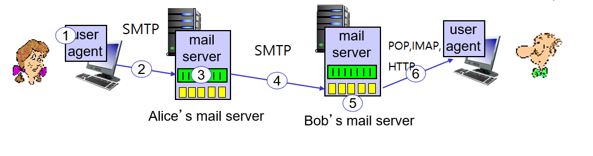

- [1. Cookies](#1-cookies)
  - [쿠키 동작 과정](#쿠키-동작-과정)
  - [세션이란?](#세션이란)
    - [세션 동작 과정](#세션-동작-과정)
- [2. web cache](#2-web-cache)
  - [캐시 conditional GET](#캐시-conditional-get)
- [3. email](#3-email)
  - [smtp protocol](#smtp-protocol)
  - [http vs smtp](#http-vs-smtp)

## 1. Cookies

프로토콜 자체는 stateless, 하지만 user와 서버의 transaction을 유지하기 위해 쿠키를 사용

쿠키를 사용하기 위해서는
1. 서버 측에서 response message에 cookie headerline을 포함해야 함
2. 서버 측에서 백엔드 데이터베이스 유지
3. 클라이언트 측에서 request message를 보낼 때 쿠키 헤더라인을 포함해야 함
4. 브라우져(클라이언트) 측에서는 쿠키 파일을 유지 쿠키파일에는 각 사이트로부터 할당받은 id 등을 기록

### 쿠키 동작 과정

1. 유저의 사이트 최초 방문 
2. request message가 서버에 도착하면 서버는 unique ID를 할당
3. response message의 헤더라인에 set-cookie: id를 담아서 보냄
4. 그 다음부터 보내는 request message에는 id를 달고 보냄
5. 백엔드에서는 그 id의 entry를 db에서 찾아서 transaction을 다 기록

기능
1. session 유지 (ex) 로그인 상태 유지, 장바구니 유지)
2. 사이트는 사용자 정보 수집 가능->추천

### 세션이란?

쿠키가 데이터의 개념이라면 세션은 '상태'의 느낌이 강하다. 

상태의 저장이 웹 서버에 저장되므로 클라이언트 pc에 저장되는 쿠키와 달리 저장용량의 제한이 거의 없다.

#### 세션 동작 과정

세션은 브라우져가 닫히거나 서버에서 삭제할 때 없어진다.
ex) 서울대학교 수강신청 프로그램: 브라우저를 닫고 열라는 메세지로 보아 한 세션에 한 번만 열 수 있도록 한 듯 (크롬과 엣지에서 동시에 여는 것은 가능)

## 2. web cache
매번 original server까지 가지 않아도 object를 가져올 수 있도록 하는 것을 목표로 만들었다.

client, server process 모두 실행해서 서버의 역할을 하기도 하므로 proxy server라고 부르기도 한다.

유저: cache를 통해서 웹에 접근하도록 설정->브라우저 request message를 cache로 보낸다. -> cache에 원하는 object가 있으면 cache에서 가져오고 없으면 오리지널 서버에서 가져온다.

웹 캐시를 사용하는 이유
1. response time을 줄인다.
2. 학교 회사 등은 이더넷 스위치들이 연결되어 있는 라우터가 isp의 라우터와 연결되는데 웹 캐시를 사용하면 isp와의 access link에서 왔다갔다하는 트래픽의 양을 줄일 수 있다.
3. poor content provider들은 웹 캐시에 그 컨텐츠가 있으면 오래 걸리지 않고 오브젝트를 전달할 수 있다.

예시
traffic intensity가 클 때
total delay=internet delay + access delay access link에서 delay + LAN delay

해결방법
1. isp 라우터와 연결된 access link의 대역폭을 늘린다.
2. 웹 캐시를 설치

hit rate가 0.4일 때 (40퍼센트는 웹 캐시에서 해결될 때)
아니었을 때 utilization:100 traffic intensity :1
웹 캐시 utilization:60 traffic intensity :0.6

### 캐시 conditional GET

original server에 계속 가지 않고 웹 캐시에 있는 정보만을 계속 사용하면 업데이트가 반영되지 않는다.

conditional GET 동작 
1. if-modified-since:<date>의 헤더를 넣어서 캐시에서 서버로 request message를 보냄
2. response messages가 not mdoified일 때: 304
 modified일 때 : 200 ok <data>

## 3. email
구성 요소 
1. user agent

    작성 편집 읽기 ex) outlook gmail
2. mail server
    사용자마다 하나씩 mailbox 와 mail queue가 있다.
    mailbox: 배송오는 메일담기 mail queue: 배송하는 메일 담기 
    client server process를 모두 돌려야 한다.
3. mail protocol (SMTP)

### smtp protocol
* tcp persistent connection 사용 
* 포트 넘버 25 
* hand shaking, transfer of messages, closure 단계
 
* 옛날에는 transfer message 단계에서 header body message가 7 bit 아스키 코드로 이루어졌었으나 지금은 다양한 문자를 보내는 프로토콜이 정의되었음
* end of message 'CRLF.CRLF'
* command: 아스키 코드 text response: status code and phrase

### http vs smtp
http : pull protocol 가져오는 하나의 메세지에 오브젝트 하나
smtp : push protocol 가져가는 하나의 메세지에 오브젝트 여러 개(multipart로 구성)
둘다 아스키 코드 command, response 
