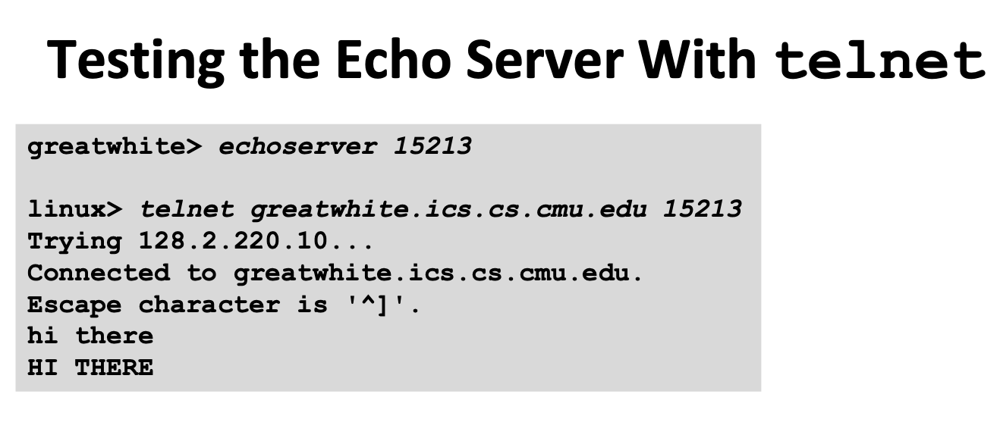

## 목차

- [목차](#목차)
- [1. 강좌 목표](#1-강좌-목표)
- [2. Mail access Protocol](#2-mail-access-protocol)
  - [2.1 POP3(Post Office Protocol)](#21-pop3post-office-protocol)
  - [2.2 IMAP(Internet Mail Access Protocol)](#22-imapinternet-mail-access-protocol)
  - [2.3 HTTP](#23-http)
- [3. DNS: domain name system](#3-dns-domain-name-system)
  - [3.1 계층1: root name server](#31-계층1-root-name-server)
  - [3.2 계층2: TLD top-level domain server](#32-계층2-tld-top-level-domain-server)
  - [3.3 계층3-1: authoritative DNS server](#33-계층3-1-authoritative-dns-server)
  - [3.4 계충3-2: Cache Name server](#34-계충3-2-cache-name-server)
  - [Caching](#caching)

## 1. 강좌 목표
- Electronic mail 서비스에 대해 학습(POP3, IMAP, HTTP)
- DNS: domain name system에 대한 이해
  
## 2. Mail access Protocol  
   
- pull protocol(incoming mailserver)
- mail server에 있는 mailbox로부터 메일을 읽어올 때 사용되는 protocol 
- <-> SMTP: push protocol(outgoing mailserver)로, sender의 mail server가 사용 
   * telnet network application    
     원격 터미널 접속 서비스
    사용법: telnet < host > < portnumber >
   

- POP3, IMAP, HTTP 

### 2.1 POP3(Post Office Protocol)  
   
- Post Office Protocol[RFC 1939] authorization, download 
- POP의 3번째 버전: POP3  
- 클라이언트 PC로 메일을 직접 다운로드  
        
*   *stateless across sessions*     
  
- **download and delete mode**    
  delete line O     
  client가 바뀌면 삭제된 메세지를 다시 읽어오는 과정이 필요하다.
- **download and keep mode**    
  delete line X          
  다른 client의 메세지를 복사해올 수 있다.
  

### 2.2 IMAP(Internet Mail Access Protocol)
- server에 모든 메세지를 한 곳에 저장 (사용자가 folder에 저장 및 정리 가능)
- *state accross sessions* - 사용자의 state 저장 가능    
  메세지 ID : folder 이름 mapping 기록
- POP3와 비교시 처리 과정이 더 복잡하다. 

### 2.3 HTTP
- 원래는 mail용이 아니지만 gmail, Hotmail, Yahoo! Mail 등등 (웹 서버에서 메일박스 접근 가능)     

## 3. DNS: domain name system 
  1) IP address(32 bit) - ex) 128.2.203.179
  2) domain name - ex) www.cs.cmu.edu
    
    
    [출처: 그림 한 장으로 보는 최신 서버 가이드북]    
    국가별 기관별 domain 존재

- internet은 DNS라고 불리는 거대한 'distributed database'에 domain name과 IP address 사이의 mapping을 가지고 있다. 
- gethostbyname vs gethostbyaddr 이용
- 1:1, 1:n, n:1 등의 mapping 가능
    
    * load distribution: 여러 IP 주소가 하나의 host name에 연관(중복 web 서버)
    * name server를 만들 때 IP 하나에 여러 개 이름이 가능하기 때문에 하나는 정식 이름 나머지는 alias명

- application layer protocol     
  
   다른 app layer protocol 들이 HTTP, SMTP 등 사용자가 제공한 host name을 IP로 변환하는데 이용 
   network edge에서 구현, (= end system: server, client )

- host aliasing       
  **canonical** -> 실제 host name  
  **alias name** -> 별명 host name    
  DNS는 IP뿐 아니라 정식 host name을 위해서도 이용    
 

### 3.1 계층1: root name server
- name server hierarchy의 가장 위에 위치
- local name server가 authoritative DNS server를 찾기 위해 접근
- 이름 반환은 수행하지 않음 
- name mapping을 모르면, authoritative name server에 contact 
  
### 3.2 계층2: TLD top-level domain server
- 최상위 도메인 com, org, net, edu, aero, jobs, museums, + all top-level country domains (uk, fr, kr, jp)
- 모든 국가의 상위 레벨 도메인에 대한 책임이 있다
- TLD: 한국 - kr, 일본- jp, 중국 - cac, 교육 - edu

### 3.3 계층3-1: authoritative DNS server
- host가 실제로 등록되어 있는 서버 
- service provider 즉 각 기관에 의해서 DNS server 관리
- IP 주소를 저장, 수정, 삭제하는 기능
- host name : IP address mapping 가진다 
  1) iterated query 
    
    * mapping 정보 제공 X 
    * 정보를 모르는 경우 어떤 서버에게 물어야 하는지를 알려준다

  2) recursive query 
    
    * 질문을 받으면 정보를 구해서 알려줌 

### 3.4 계충3-2: Cache Name server
   
    [출처: 그림 한 장으로 보는 최신 서버 가이드북]    
- 자신이 저장하고 있지 않은 도메인에 대한 IP 주소 질문을 받았을 때 IP 주소를 알고 있는 다른 서버에게 질문을 하는 서버 
- (<-> authoritative DNS는 답변하는 서버)   
- ISP는 최소 하나의 local name server(Cache)를 가짐 
- = default name server => proxy로 작동
- **proxy: (주로 보안을 위해) 웹 서버로부터 웹 페이지를 캐시로 저장하는데 쓰임**
- host ----(DNS 질의) ----> local name server ----->DNS서버 계층

### Caching
- name server가 mapping을 하면 해당 mapping을 cache 한다.
- DNS 요청에 대한 응답을 받을 시 local memory에 저장한다. 
- TLD server는 주로 local name server에 cache된다. 
- root server를 우회할 수 있도록 해줌
- 
- 
