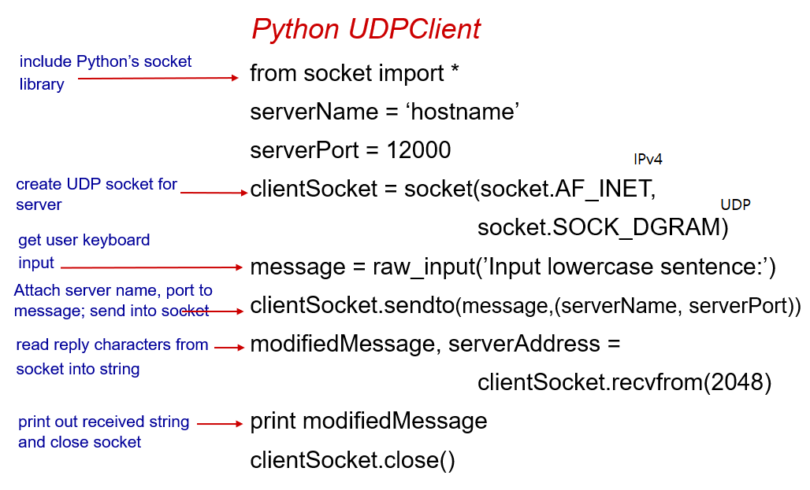

## 목차
- [목차](#목차)
- [1.Socket Programming](#1socket-programming)
  - [Socket Programming with UDP](#socket-programming-with-udp)
  - [with TCP](#with-tcp)

## 1.Socket Programming

개발자가 작성하는 어플리케이션 계층과 운영체제가 담당하는 transport 계층 사이의 인터페이스인 **소켓**

### Socket Programming with UDP

* no handshaking
* 각 데이터마다 목적지 ip, 포트 넘버를 붙여서 보내게 됨 
* 서버는 받은 segment(packet)로부터 클라이언트의 포트 번호를 알아내서 response를 전송
* 전송에 대한 보장이 없음

1. 서버 프로세스가 먼저 실행되기 시작해서 서버 소켓 create
2. 클라이언트 소켓 create 네트워크가 서버 ip, 포트 번호를 가지고 있는 datagram을 인터넷이 서버에 전달
3. 서버 소켓을 통해 서버 프로세스는 데이터를 읽어오고 서버소켓을 통해 client address 포트 넘버를 담아 response를 내보낸다.

*클라이언트 udp에서 데이터를 내보낼 때 운영체제에서 client address ip주소와  포트 번호가 붙인다.*

udp client program(python)

* serverName에는 mm.ewha.ac.kr같은 hostname도 들어갈 수 있고 ip 주소도 들어갈 수 있는데 ip 주소가 실행되면 자동적으로 dns client process가 실행돼서 host name을 알아온다
* 소켓 생성할 때 인자로 사용할 네트워크, 사용할 소켓의 종류(트랜스포트 프로토콜)를 명시해줘야 **운영체제가 클라이언트 주소(ipv4주소 체계의 주소)와 포트 번호를 할당**해줄 수 있다.

udp server program (python)

클라이언트는 서버에 소문자로 메세지를 보내고 서버는 클라이언트에 대문자로 메세지를 보낸다

### with TCP

* 서버는 실행 중이어야 하고 실행되면 제일 먼저 소켓을 만든다
* 이 소켓은 웰컴 소켓, 도어 소켓으로 클라이언트의 컨택을 받아들이기만 하는 용도
* 클라이언트는 TCP 소켓을 만들면서 핸드쉐이킹을 위해 컨택할 서버의 IP 주소와 포트 번호를 명시하고 커넥션을 형성
* 서버는 클라이언트와 컨택하기 위해 새로운 소켓을 만든다.
* 데이터가 내려온 소켓에 따라 TCP는 목적지를 알 수 있기 때문에 커넥션을 셋업하고 나면 TCP는 목적지를 명시하지 않는다 
* UDP vs TCP
  
  udp- 각 메세지 단위의 통신이라 response를 보내면 끝이지만 통신 끝

  tcp- byte-stream 통신(한 번에 1 byte씩 연속적으로 데이터를 보내는 통신)이기 때문에 다른 클라이언트의 segment도 별개로 받을 수 있어야 해서 웰컴 소켓이 있고 커넥션 소켓을 클라이언트 별로 만든다

tcp client (python)
* 소켓 만들 때 똑같이 사용할 네트워크, 소켓의 종류 트랜스포트 포로토콜 명시
* send()함수에서는 목적지 설정없이 데이터만 인자로 입력
recv에서 받을 때도 메세지만 추출

tcp server process(python)
* 서버 포트 번호 명시는 필요
* 운영체제가 ip주소와 가용한 포트번호를 할당
* .accept()로 새로운 커넥션 소켓이 생긴는데 이 소켓의 포트 번호는 앞에서 지정한 serverPort 번호가 아니다. 하지만 생긴 소켓의 포트 번호는 tcp 통신에서 알 필요가 없다.
