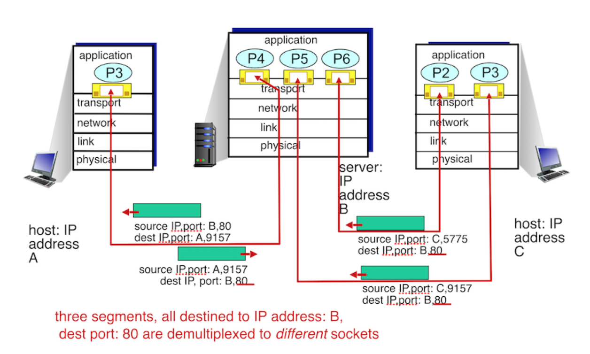

## 목차
- [목차](#목차)
- [복습](#복습)
  - [Q. Application Layer란?](#q-application-layer란)
  - [Q. Transport Layer란?](#q-transport-layer란)
- [1.Multiplexing & Demultiplexing in UDP & TCP](#1multiplexing--demultiplexing-in-udp--tcp)
- [2.Connectionless Transport: UDP](#2connectionless-transport-udp)
- [3.Principles of Reliable Data Transfer](#3principles-of-reliable-data-transfer)
- [4.TCP(Transmission Control Protocol)](#4tcptransmission-control-protocol)

## 복습
   

### Q. Application Layer란?
- 네트워크 소프트웨어 UI 부분, 사용자의 입출력(I/O) 부분
- email, web, YouTube, Skype etc.
- HTTP, SMTP
- Socket을 통해서 Transport Layer와 통신 

### Q. Transport Layer란?
- 통신을 활성화하기 위한 계층: process 간 communication을 위한 protocol 
- network layer => host to host 
- Transport layer => process to process 
  

## 1.Multiplexing & Demultiplexing in UDP & TCP
1. Connectionless Demux
  
  - server socket은 '하나'만 열림! -> 이걸 통해서 client들 접근
  - **dest IP & port 를 보고 Demultiplexing! 

2. Connection-oriented Demux 
      
  - server socket은 '여러 개' 열림! -> 특정 client를 위한 특정 socket 즉, 하나의 app에 '여러' socket 가능! 
  - client와 contact 할 때마다 socket을 열어줘야 한다. 
  - **source IP & port, dest IP & port** 를 모두 보고 Demultiplexing!

## 2.Connectionless Transport: UDP
1. UDP(User Datagram Protocol)
   - 데이터를 datagram 단위로 처리하는 protocol
   - datagram: *패킷 교환에서 각각 독립적으로 취급되는 개별적인 패킷을 의미*
  - **Connectionless** 각 패킷은 다른 경로로 전송되고, 독립적인 관계를 가짐
                        connection 설정, 해제 과정이 존재하지 않음
  - Congestion control, Flow control 등 제공 X          
    - **Congestion Control**    
         네트워크 내의 패킷 수가 너무 많지 않도록 패킷 양을 조절하여 혼잡 붕괴 현상 방지        
    - **Flow Control**      
          데이터 송신, 수신하는 곳의 데이터 처리 속도를 조절하여 수신자의 buffer overflow를 방지       
  - 정보를 주고 받을 때, 정보를 보내거나 받는다는 신호절차를 거치지 않음
  - UDP 헤더의 CheckSum field를 통해서 최소한의 오류만 검출
  - 신뢰성이 낮음(순서대로 전달 X), TCP보다 속도가 빠름
  - UDP use:
    -	streaming: (민감하지 않음-loss tolerant / 속도-rate sensitive) 
    - DNS – query 여러 번 보내고 받는 경우 X. 단 한 번 보내고 받는다 => transaction type   
      TCP라면 connection을 맺는데 이는 overhead가 크기 때문에 UDP를 사용하는 것 
    - SNMP – group of network -> 정기적으로 report하는 네트워크 관리 프로토콜 
  - reliable transfer   
    - data의 무결성이 중요한 경우 사용. reliability check하는 function을 사용하고 있고, error 발생 시 recover하는 방법을 보유하기에 이런 overhead 피하기 위해서 사용하는 경우도 있다. 
  
  **장점**
    
    - short delay(no connection - 1 RTT), simple(independent), small header size(traffic overhead 작음)

  **UDP Checksum** 
  - Checksum: network를 통해서 packet을 송수신 할 때, header나 data가 손상되지 않았다는 것을 보증하기 위해서 사용
  - 계산과정
    - Sender & Receiver: 16 bit 계산(bitwise addition) with one's complement method 
    - 계산 결과가 같다면 오류 X 판단
        - 하지만, 계산 결과값은 같지만 계산 과정 상에서 오류가 있을 수 있음. -> UDP protocol은 이를 위한 조치를 취하지는 않음. 
  - one's complement -> 1의 보수
    
  - two's complement -> 2의 보수
    

## 3.Principles of Reliable Data Transfer
  
  1. **Checksum**: 전송된 packet에 오류가 있는지 검출 
  2. **Acknowledgement & Negative Acknowledgement**: 전송을 잘 받았는지 아닌지 / 오류에 대한 정보를 알려줌
  3. **Timer**: Sender가 Ack를 기다릴 때, 시간 제한을 둠(Timer Field)
  4. **Sequence Number**: 이전에 전송된 packet이 다시 전송되는 경우에 이미 전송받은 packet인지 구별해줌
  5. **Pipelining**: Packet <-> Ack의 효율적인 전송을 위한 pipelining
      
      

## 4.TCP(Transmission Control Protocol)
  - **Point to Point** 
    - 1 sender - 1 receiver     
  - **Reliable & in-order**     
    - flow controll & congestion controll에 따라서 Buffer에 저장한 data byte stream을 전송    
  - **Pipelined** : window 크기 만큼 pipelining for throughput     
  - **Full duplex data**    
    - 일뱡향이 아닌, client-server 양쪽에서 데이터 전송 가능     
  - **Connection-oriented** : handshaking     
  - **Flow controlled**    
  - **Congestion controlled**      
  - **Segment Structure**      
          
    - 가변영역(Options) || 고정영역(나머지)        
      - 가변적인 Header로 인해 Header Length field 존재      
    - *Header Length == Data Offset*    
      - 고정 길이 - 4 byte 단위, 일반적으로 20 byte     
        - header length = 5 * 4 bytes = 20 bytes    
      - 4 bit(1111(2) == 15) : 15 * 4 bytes = max. 60 bytes   
    - Sequence Number
      - 송신자가 보내는 데이터의 시작 byte 숫자, 즉 보내는 데이터가 connection 시작 후 몇 번째 데이터인지를 표시       
    - Acknowledgment Number 
      - 송신자에게서 받은 데이터 byte + 1, 즉 상대방이 N-1번째 바이트까지 보냈다면, N번째 바이트를 보내야한다는 의미   
    - Receive Window    
      - Flow control을 위한 field   
      - 남은 buffer size와 관계해서, 수용 가능한 receive window size 정보   
    - TCP flags         
      - URG: Urgent pointer 정상인지 check하지만 실제로는 사용 X,  urgent한 데이터를 포함하여 버퍼에 있는 모든 데이터를 push한다. 단, 어떤 데이터가 urgent data인지 표시하는 pointer field를 사용한다  (PSH과 다른점).      
      - ACK: ack number field 확인, 첫 SYN 일 때, ACK field도 set -> 상대방에게 받은 data 관련    
      - PSH: Push flag. 실제로 사용하진 않지만, 현재 보내는 데이터를 포함한 buffer에 있는 모든 데이터를 바로 push 해달라는 flag     
      - RST, SYN, FIN -> Connection Flags         
          - RST(reset): 송신자가 공식적인 종료 절차 없이 종료하길 원할 때, -> 비정상적인 세션 연결 끊기     
          - SYN(sync): connection 초기에 사용되는 field, 처음엔 seg는 임의생성, base로 이후에 데이터 전송시마다 사이즈만큼 증가         
          - FIN(finish): TCP 연결 해제 원할 때 사용       
    - Window size   
      - 수신 가능한 Receive window size buffer의 size를 의미    
    - Checksum    
      - segment가 정상인 것을 증명하는 field    
            
            

  **TCP Round Trip Time & Timeout** 
  - Ack를 계속 기다리지 않게 하기 위한 Timer로, RTT(Round Trip Time)과 관련       
  - Too short estimation: 불필요한 retransmission         
  - Too long estimation: segment loss에 너무 느리게 반응          
  - 예측 방법?      
    - Sample RTT 평균을 가지고 예측한다       
