<!-- omit in toc -->
## 목차
- [1. 3-way handshake](#1-3-way-handshake)
  - [2-way handshake failure](#2-way-handshake-failure)
  - [3-way handshake](#3-way-handshake)
  - [3-way handshake FSM](#3-way-handshake-fsm)
  - [Closing a connection](#closing-a-connection)
- [2. Principles of Congestion Control](#2-principles-of-congestion-control)
  - [Congestion](#congestion)
  - [Congestion 발생 원인](#congestion-발생-원인)
  - [Congestion 해결 방안](#congestion-해결-방안)
  - [TCP congestion control: AIMD(Additive Increase Multiplicative Decrease)](#tcp-congestion-control-aimdadditive-increase-multiplicative-decrease)
  - [TCP slow start](#tcp-slow-start)
  - [TCP: detecting, reacting to loss](#tcp-detecting-reacting-to-loss)
  - [TCP throughput](#tcp-throughput)
  - [TCP fairness](#tcp-fairness)

## 1. 3-way handshake
지난 시간에 이어...
### 2-way handshake failure
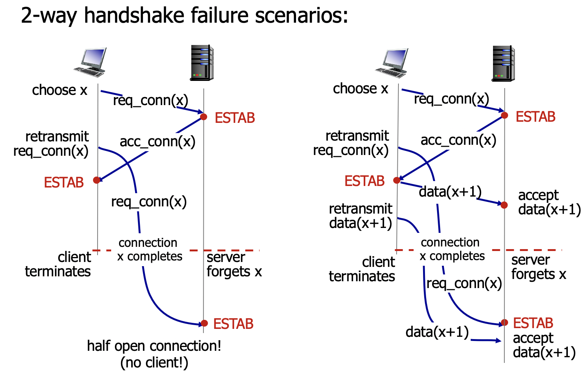
- 2-way handshake의 경우 서버는 클라이언트로부터 받은 최초의 request만으로 현재 클라이언트가 살아있다는 것을 확신할 수 없다. 

### 3-way handshake
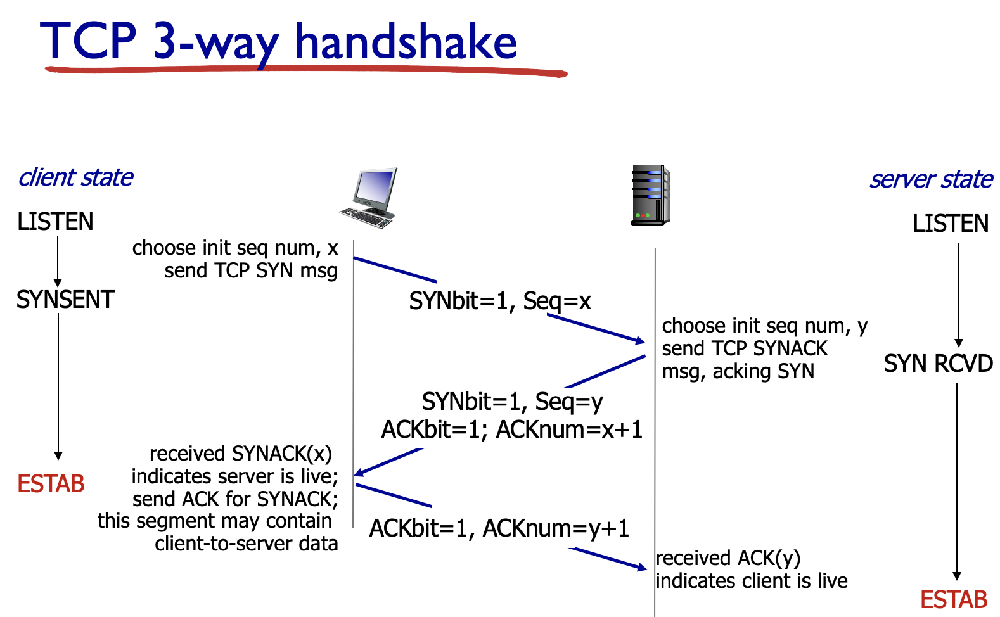
- Client -> Server: 
  - SYNbit = 1
  - Seq: Client 지정 initial SeqNum (x)
- Client <- Server => client ESTAB
  - SYNbit = 1, Seq: Server 지정 initial SeqNum (y)
  - ACKbit = 1, ACKnum = x+1
- Client -> Server => server ESTAB
  - ACKbit = 1, ACKnum = y+1
  - Application data를 포함시켜 보낼 수 있다. Seq = x+1

### 3-way handshake FSM
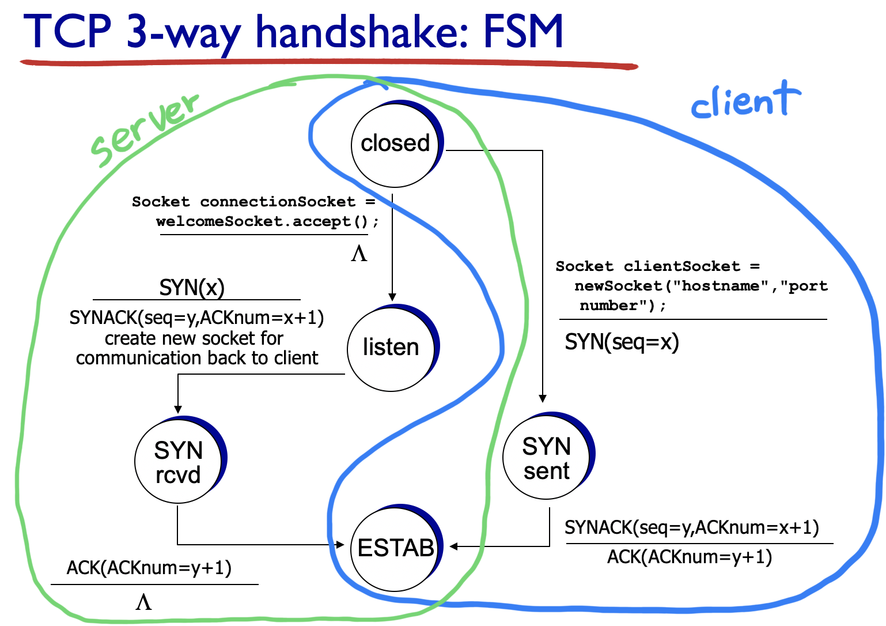
- Client
  - Closed 상태로 시작
  - Application에서 socket을 만들어 server에 SYN 보내 SYN sent 상태로 들어감.
  - SYNACK을 server로부터 받으면 ACK을 보내게 되고 ESTAB 상태로 들어감.
- Server
  - Closed 상태로 시작
  - Application이 실행되면 welcomsocket(or doorsocket)을 만들고 listen 상태로 들어감.
  - Client에서 SYN를 받으면 해당 client와 소통할 수 있는 socket을 만들고 SYN rcvd 상태로 들어감.
  - 이후 ACK을 받으면 ESTAB 상태로 들어감.

### Closing a connection
- Server와 client 양측 모두 FIN seg에 FIN bit = 1로 설정해서 전송하여 connection close를 요청할 수 있음 
- 상대방의 FIN seg에 대해서 ACK을 보내며 함께 자신의 FIN seg도 보낼 수 있음
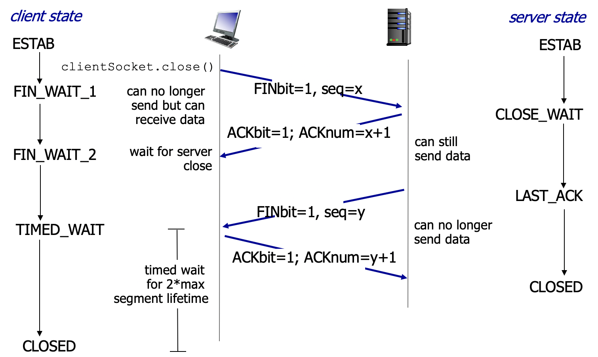
- Client가 server에 FINbit을 보낸다. (FIN_WAIT)
- Server는 FINbit을 받아 ACK를 보낸다. (CLOSE_WAIT)
- Server가 client에 FINbit을 보낸다. (LAST_ACK_WAIT)
- Client는 FINbit을 받아 ACK를 보낸다. (TIMED_WAIT -> CLOSED)
  -  Client는 마지막 ACK를 보내면서 왜 바로 CLOSED 상태로 들어가지 않을까? 
  - 이는 ACK가 중간에 유실되어 server에서 FINbit을 재전송 했을 때 응답할 client가 살아있어야 하기 때문이다. ~~사실 실제 상황에서는 복잡한 과정들이 더 많이 있다고 한다.~~
- Server는 ACK를 받는다. (CLOSED)

## 2. Principles of Congestion Control
### Congestion
- Congestion: Source들이 네트워크로 감당하지 못할 정도의 데이터를 밀어넣어 생기는 문제를 말한다. 
  - Long delays (Queueing in router buffers)
  - Lost packets (Buffer overflow at routers)

> Flow control: 송신측과 수신측의 데이터처리 속도 차이를 해결하기 위한 기법

### Congestion 발생 원인
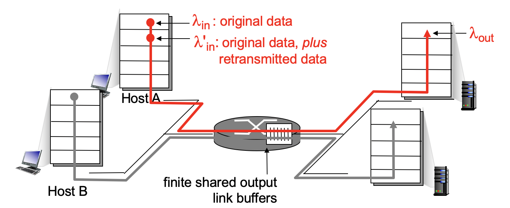
> Retransmit된 data까지 고려해서 보낸 총 data를 갖고 이야기 해야한다. 

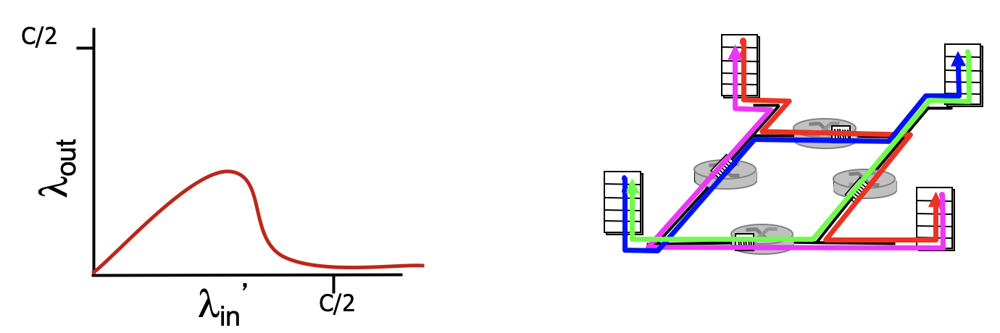
- goodput(): Destination에 도달하는 유효한 data. 이 기준치 이상으로 증가할 경우, 
  - 불필요한 Retransmission 발생: 중복 데이터 증가
  - Packet drop: Packet이 drop되기 전까지 이용된 네트워크 자원이 낭비된다. 
  - 결과적으로 goodput이 급격히 감소한다. 

### Congestion 해결 방안
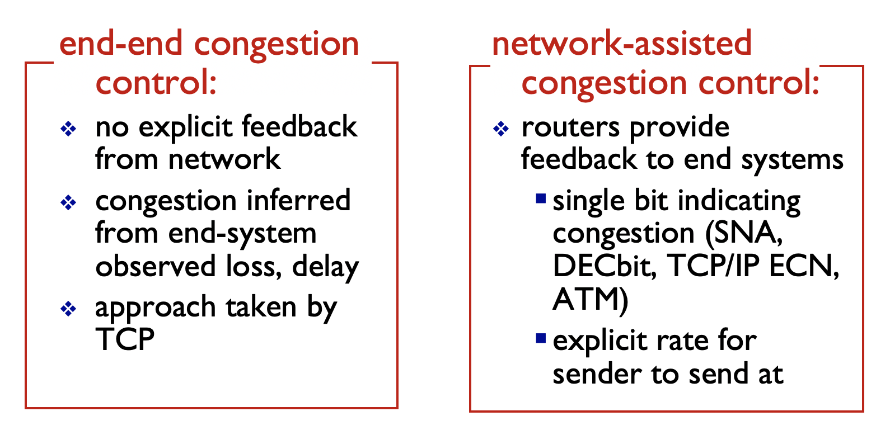
- end-end congestion control
  - 실제 congestion은 네트워크 내부에서 발생함에도 불구하고 네트워크는 source에 명시적으로 rate를 낮추라는 요청을 보내지 않음.
  - End system이 loss나 delay로 congestion 상황을 감지하고 조치를 취함.
  - TCP는 인터넷의 프로토콜이므로, 패킷을 전달하는 것을 제외한 모든 복잡한 프로세스는 edge에 맡기기 때문에 이런 방식을 택함. 
- network-assisted congestion control
  - Router에서 가장 먼저 congestion을 감지하고 end system에 알린다. 
  - Single bit를 이용해서 congestion 상황을 알리거나 explicit rate을 보내기도 한다. 

### TCP congestion control: AIMD(Additive Increase Multiplicative Decrease)
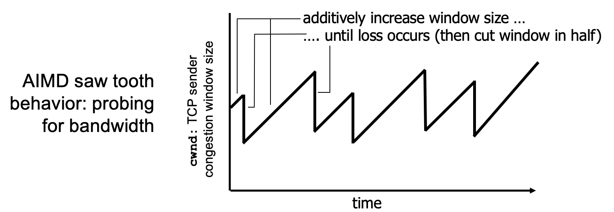
- Additive increase: Loss를 감지하기까지 CWND를 ACK마다 점진적으로 늘린다. 
- Multiplicative decrease: Loss를 감지하면 CWND를 절반으로 줄인다. Loss를 감지하면 congestion을 경험한 것이기 때문에 즉각적인 행동이 필요하다.  

> TCP Receive Window (RWND) : 수신측이 Ack 없이 한번에 data를 받을수 있는 크기. (가용 가능한 Buffer Size)
>
> TCP Congestion Window (CWND) : 송신측이 Ack 없이 한번에 data를 보내는 크기. (Congestion Control을 위하여 계속 변동)

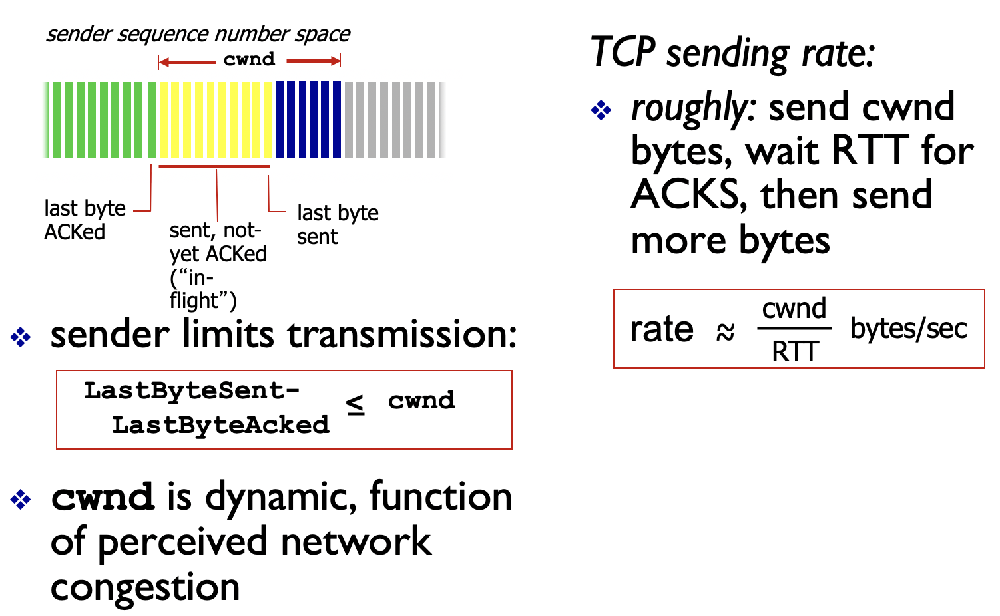
- **LastByteSent - LastByteAcked < min(RWND, CWND)** 를 유지시킨다. 
- CWND만큼은 RTT동안 보내지는 데이터 최대양이기 때문에 **TCP의 sending rate은 대략 CWND/RTT (bytes/sec)** 가 된다. (RWND 무시)

### TCP slow start
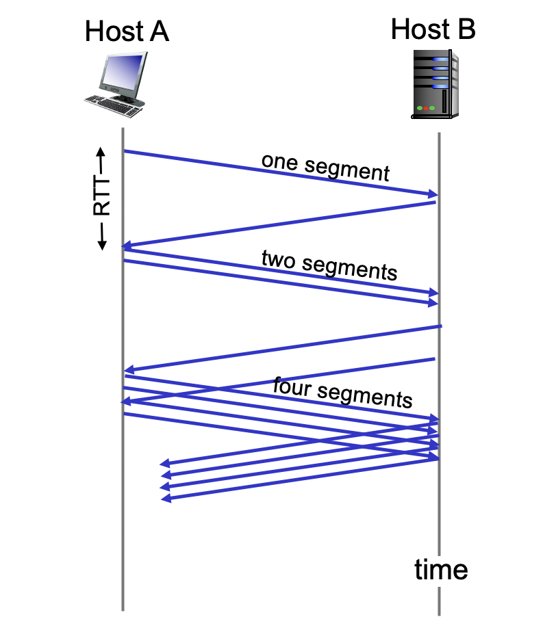
- 처음에는 1개를 내보내지만 ACK마다 CWND를 1MSS 증가시키기 때문에 RTT마다 CWND는 2배씩 증가한다. 
> 1sent-> ACK 1recive 2sent -> ACK 2recive 4sent -> ACK 4recive 8sent -> ... -> ACK n recive 2n sent
- CWND가 매우 커지면 congestion이 발생하기 때문에 ssthresh라는 기준치를 정해 이보다 작을 때는 CWND를 RTT마다 2배씩 늘리고 ssthresh보다 클때는 RTT마다 1MSS씩 늘린다. 
> ssthresh: 처음엔 OS가 정한 default value로 시작한다. Loss를 감지하면 CWND/2로 설정한다. 

~~애들 왤케 수업을 안들어~~
```
if CWND < ssthresh:
  slow start (x2)
else:
  congestion avoidance phase (+1)
```

### TCP: detecting, reacting to loss
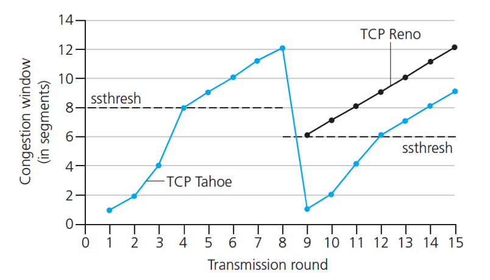
- Detecting congestion
  - Timeout
    - 전송을 할 수 없는 경우. 심각한 congestion으로 CWND를 1MSS로 설정한다. 
    - CWND가 1MSS가 되었으므로 slow start(x2)를 하게 된다. 
  - 3 duplicate ACKs
    - Loss가 있지만 그래도 데이터가 전송되고 있다는 의미이므로 CWND를 반으로만 줄인다. (**TCP RENO 방법**)
    - CWND가 반으로 줄어 ssthreash이상이 되었으므로 congestion avoidance phase(+1)에 들어간다. 
- **TCP Tahoe** 방법에서는 timeout은 물론, 3 duplicate ACKs의 경우에도 CWND를 1MSS로 줄인다. 

### TCP throughput
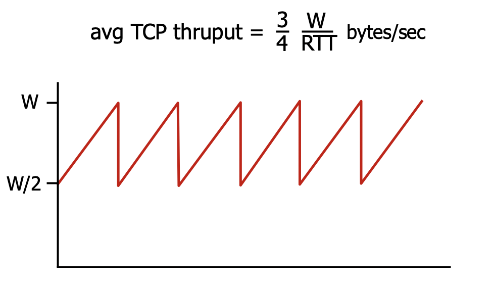
- Loss가 W에서 나는 네트워크에서 TCP의 throughput은 3/4*W/RTT이다. 

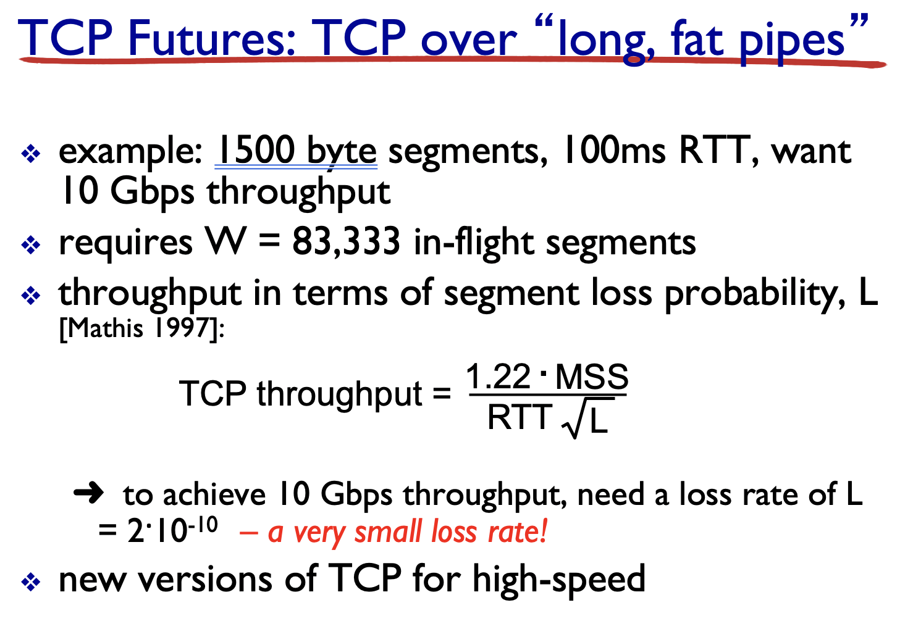
> long, fat pipes 에서 10Gbps와 같이 높은 throughput을 갖기 위해서는 loss rate이 2*10^(-10)정도로 작아야한다. 이는 매우 어렵기 때문에 이와 관련된 연구가 많이 진행되고 있다고 한다. 

### TCP fairness
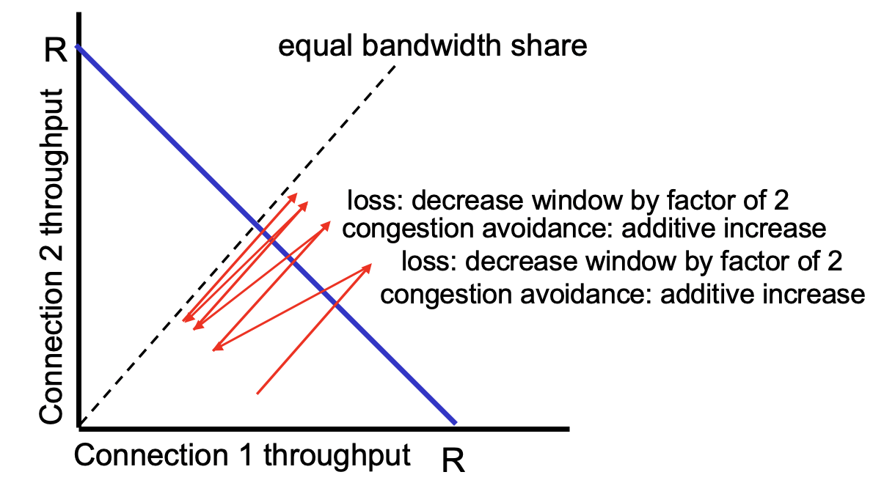

- 두 개의 연결이 있고 그 둘의 bottleneck 등 조건이 같을 때, 하나의 연결이 다른 연결보다 높은 throughput을 갖고 있다고 하더라도 시간이 지나면 그 둘은 같은 throughput을 갖게된다. 
- 하지만 bottleneck 등의 조건이 다르면 결과적으로 unfair해진다. 
- 또 UDP는 loss를 고려하지 않으므로 TCP를 힘들게 한다.
- parallel TCP를 사용하는 application은 1개의 TCP를 사용하는 application보다 많은 throughput을 갖는다. 