<!-- omit in toc -->
## 목차
- [1. 강좌 목표](#1-강좌-목표)
- [2. Timeout Interval](#2-timeout-interval)
  - [2.1 SRTT(smoothed RTT)](#21-srttsmoothed-rtt)
  - [2.2 Safety margin](#22-safety-margin)
  - [2.3 timeout이 되면?](#23-timeout이-되면)
- [3. TCP Reliability](#3-tcp-reliability)
  - [3.1 요소](#31-요소)
  - [3.2 sender의 입장 (simplified)](#32-sender의-입장-simplified)
  - [3.3 receiver의 입장 (simplified)](#33-receiver의-입장-simplified)
- [4. TCP Flow Control](#4-tcp-flow-control)
  - [4.1 Free buffer space](#41-free-buffer-space)
- [5. Connection Management](#5-connection-management)
  - [5.1 2-way handshake](#51-2-way-handshake)
  - [5.2 3-way handshake](#52-3-way-handshake)

## 1. 강좌 목표

- TCP Timeout Interval 계산하는 방법
- 통신이 일어날 때 TCP에서 일어나는 event를 sender와 receiver 입장에서 알아본다.
- Ack, Sequence #, SendBase를 이해한다.
  
## 2. Timeout Interval
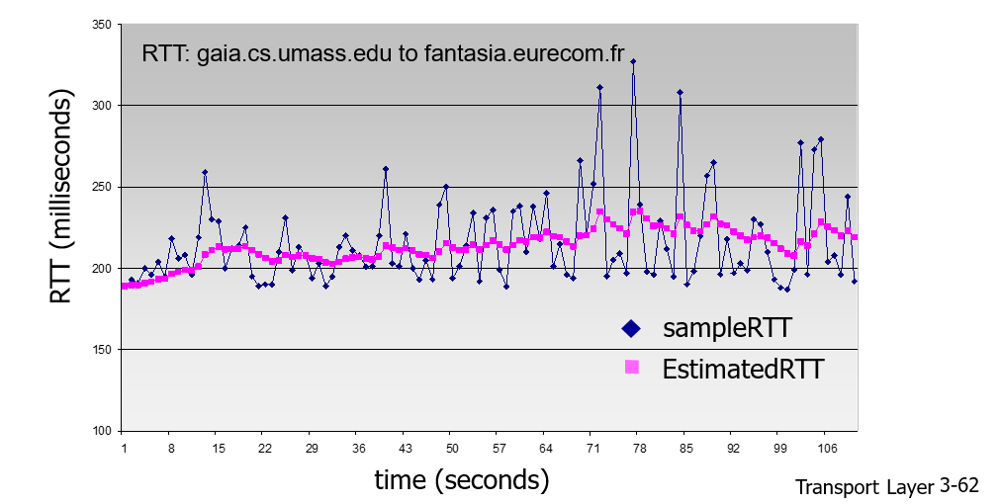
- sender는 segment를 전송할 때마다 RTO(Retransmission Timeout)를 가동해서 특정 시간이 지나도 ack가 안 오면 sequence가 제대로 송신되지 않았다고 판단해서 재전송한다. timer의 설정 시간을 *Timeout Interval* 라고 한다.
- 위의 그래프에서 알 수 있듯이 sampleRTT는 dynamic하게 변화한다.
- EstimatedRTT > sampleRTT  => 재전송하기까지 필요이상으로 기다려야 함.
- EstimatedRTT < sampleRTT  => 제대로 송신되었는데도 재전송하는 낭비가 생김.
- **EstimatedRTT가 sampleRTT보다 약간 큰 것이 이상적이다.**

### 2.1 SRTT(smoothed RTT)
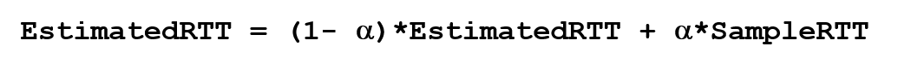
- MRTT(measured RTT) : 측정된 RTT
- MRTT를 이용해 단순평균 방식이 아닌 가중평균 방식으로 최근 샘플값에 높은 가중치를 주어 계산한 것이 SRTT.
- 일반적으로 alpha = 1/8

### 2.2 Safety margin
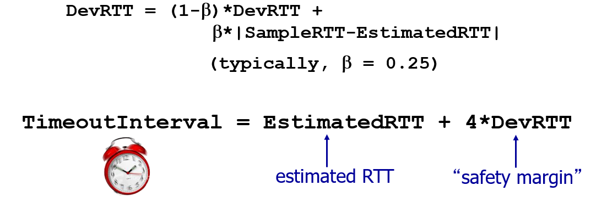
- 그래프에서 알 수 있듯이 sampleRTT는 변동폭이 커서 average로 접근하는 것이 적절하지 않다. 그래서 가중평균을 구한 후 변동성을 고려하고자 RTTVAR(round-trip time variation) RTT 편차를 더해준다. 이것을 safety margin, DevRTT 이라고도 함.
- 일반적으로 Beta = 1/4

### 2.3 timeout이 되면?
- 재전송 segment는 RTT의 측정 대상에서 제외 됨. 즉, 새로 전송하는 segment만을 RTT 측정 대상으로 삼음. 
  
## 3. TCP Reliability
### 3.1 요소
- Header에 달린 checksum
- Ack(acknowledgement), nack(negative-acknowledgement)
- pipelining & sequence #
- timer 사용

### 3.2 sender의 입장 (simplified)
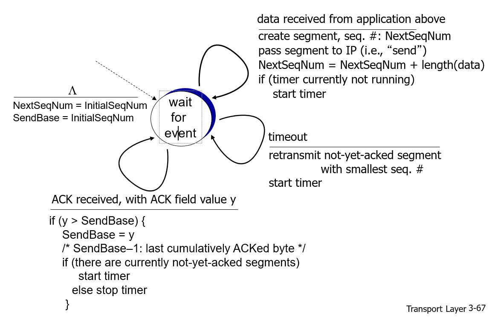
1. 상위계층인 Application layer로부터 data를 받으면 seq #와 checksum을 header에 붙여준다. 
2. NextSeqNum update.
3. timer가 작동중이지 않으면, 즉, 현재 ACK를 기다리는 중이 아니면 timer를 가동한다. 
4. timeout이 발생하면 ACK를 받지 못한 segment중 sequence #가 가장 작은 애를 retransmit한다.
5. ACK를 받으면 SendBase 변수를 update. receiver가 기대하고 있는 다음 byte 값. 

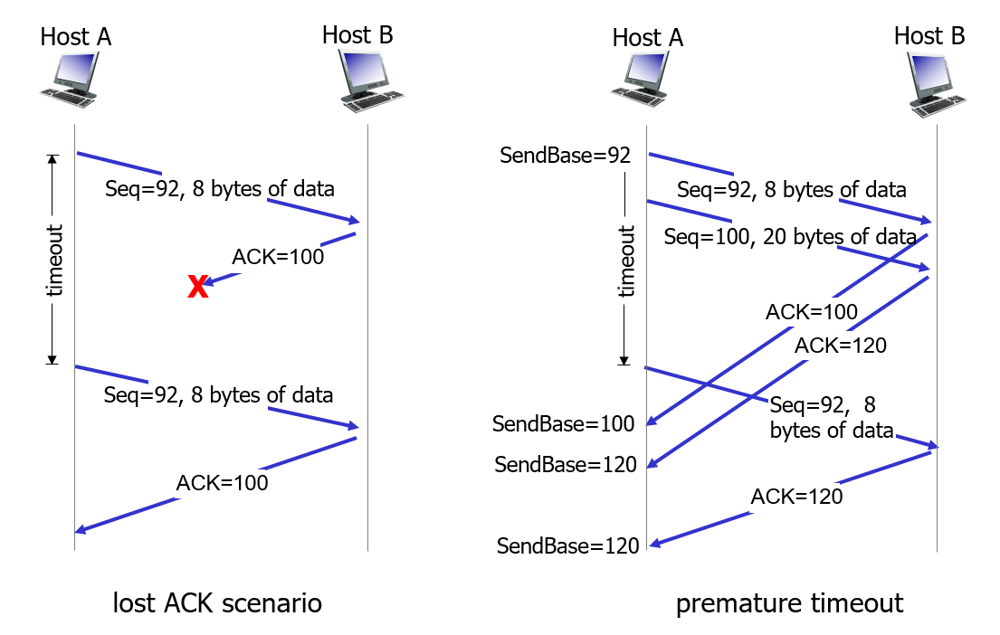
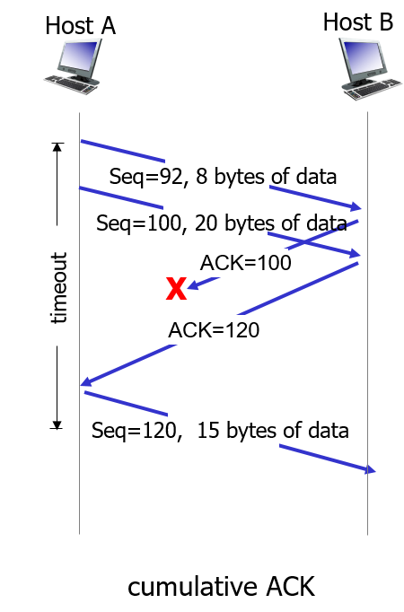

### 3.3 receiver의 입장 (simplified)
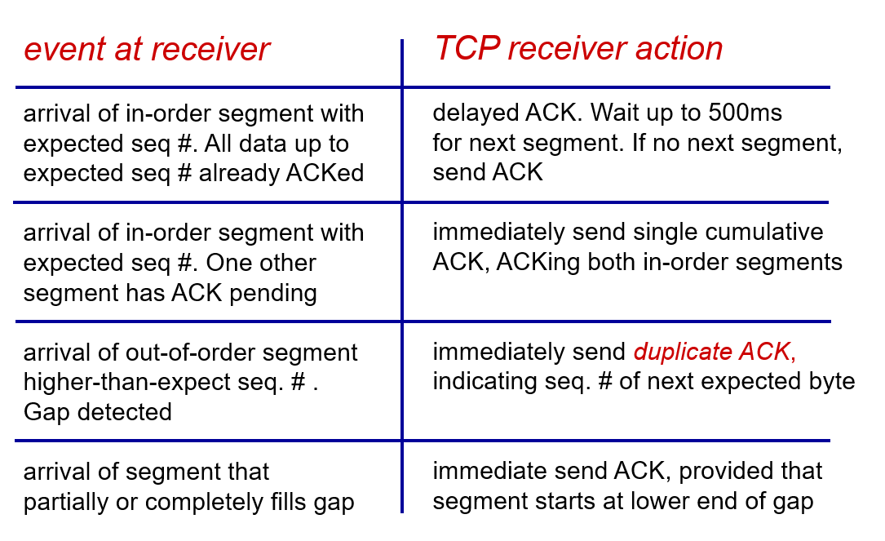
- 순서에 맞는 데이터가 도착하면 잠깐 기다렸다가 ACK 전송. 기다리는 이유는 보통 sender가 데이터를 연속적으로 보내서 묶어서 ACK를 전송하기 위해서. TCP가 Cumulative, in-order이기 때문에 가능하다. 단, 너무 오래 기다리면 retransmission 발생할 수도.
- ACK 전송 기다리는 애가 하나 있는 상태에서 순서에 맞는 데이터가 들어오면 묶어서 ACK 전송. 최대 2개씩 묶어서 ACK를 보낸다.
- 순서에 맞지 않는 segment가 들어와서 중간에 gap이 생기면 duplicate ACK를 보낸다. (ACK=100을 보냈는데 Seq=120인 segment가 들어오면 ACK=100을 다시 보낸다)  
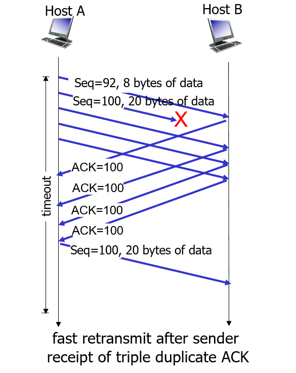
=> **TCP Fast Retransmit : duplicate ACK를 3개 받으면 unacked segment 중 sequece # 가 가장 작은 segment를 재전송. 3개나 기다리는 이유는 TCP가 재전송을 최대한 피하기 때문.**
- gap을 채우는 segment가 도착하면 delay 없이 바로 ACK를 전송한다. 

## 4. TCP Flow Control
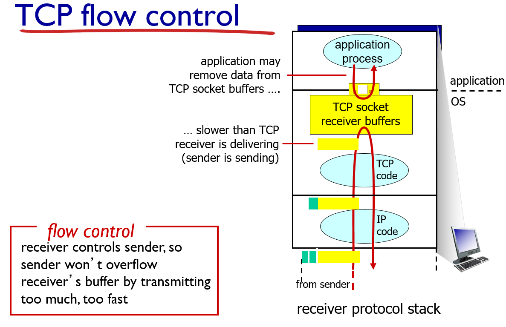
1. Link layer를 거침
2. Network layer에서 올바른 destination에 도착했는지 확인
3. TCP에서 바로 application layer로 넘기지 않고 socket buffer에 저장. buffer는 socket을 생성할 때 OS에서 할당해준다. 

- 만약 socket buffer가 차오르면 data loss가 발생. 따라서 buffer가 차오르는 속도를 조절할 필요가 있다. => flow control

### 4.1 Free buffer space
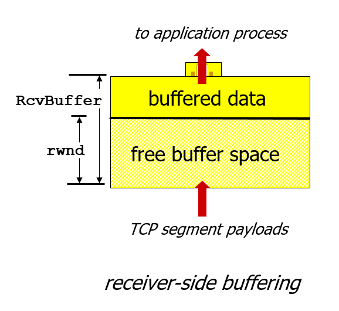
- Receiver가 Sender한테 보내는 TCP header의 rwnd value에 socket buffer의 사용할 수 있는 영역의 크기를 적어서 보낸다. 
- Sender는 rwnd value를 바탕으로 보내는 segment의 양을 조절해 overflow를 막는다.  

## 5. Connection Management 
- TCP는 경로를 정해놓는 통신이다. 그래서 sender와 receiver의 handshaking이 사전에 일어난다. 
- 그런데 connection의 establishment는 2-way가 아니라 3-way를 거쳐 일어난다.
  
### 5.1 2-way handshake
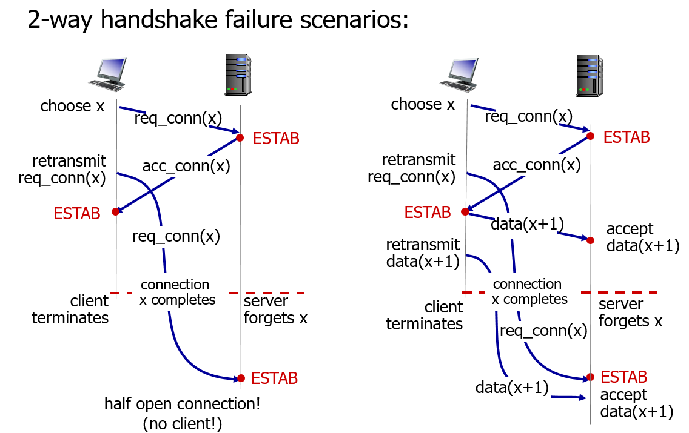
- request를 retransmit해서 connection 끝난 후에 도착하면 server가 불필요하게 connection을 open하는 낭비가 발생.
- 더해 data도 retransmit 했다면 trash data를 receive하는 낭비가 발생한다. 
- 이것을 막기 위해 3-way handshake를 사용.

### 5.2 3-way handshake
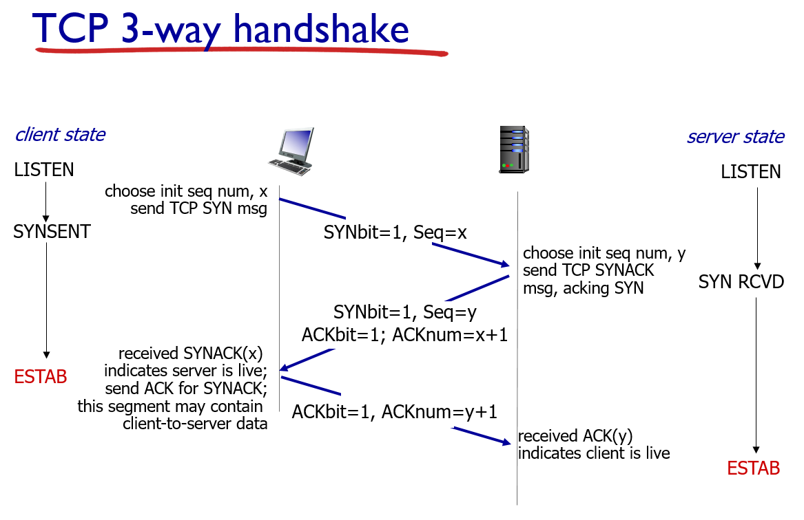
- request(client) -> accept(server) -> accept에 대한 ACK(client)
- client는 ACK를 전송할 때, server는 ACK를 받을 때 connection을 establish한다. 
- 자세하게는 다음에 설명해준다고 하심.
- 2-way에서와 같은 상황이 발생하면 어떻게 막는가?

