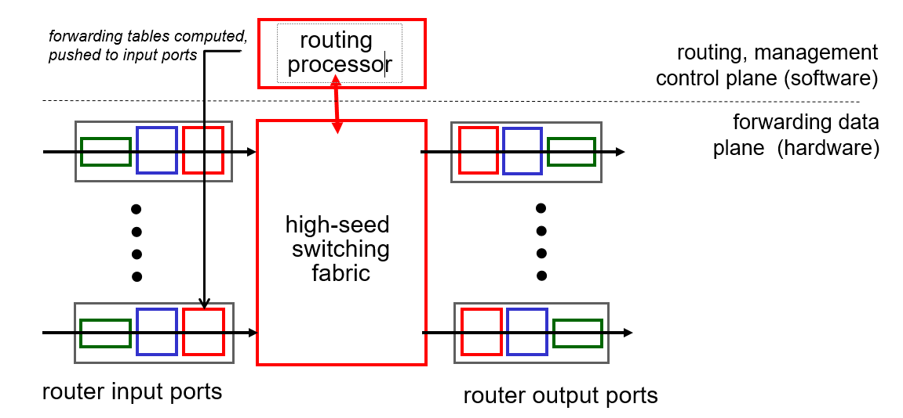
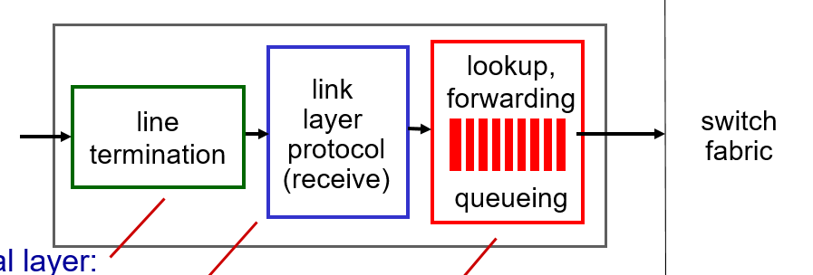
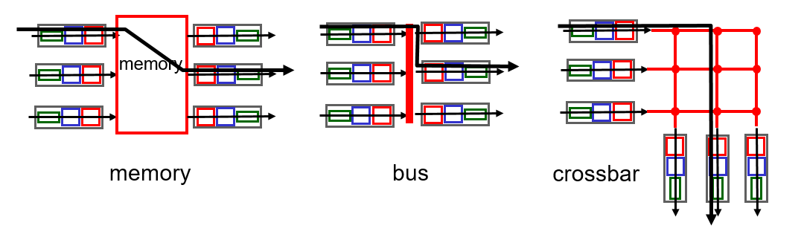
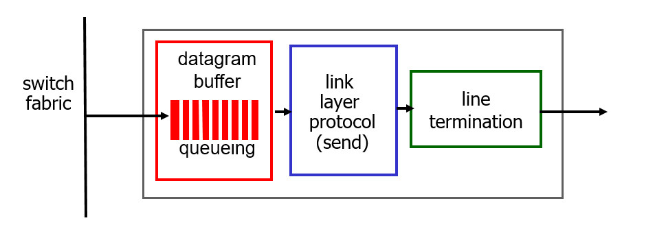
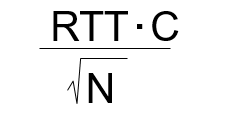
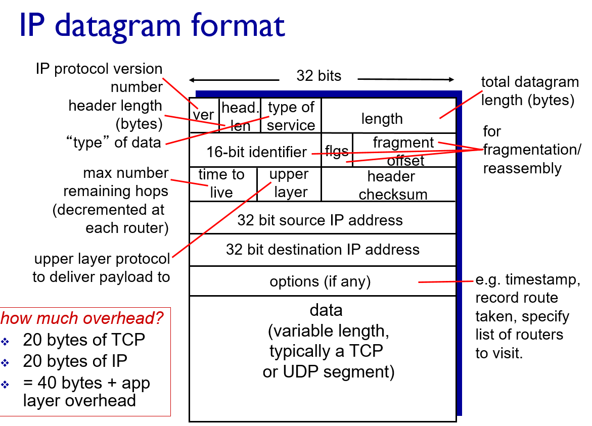
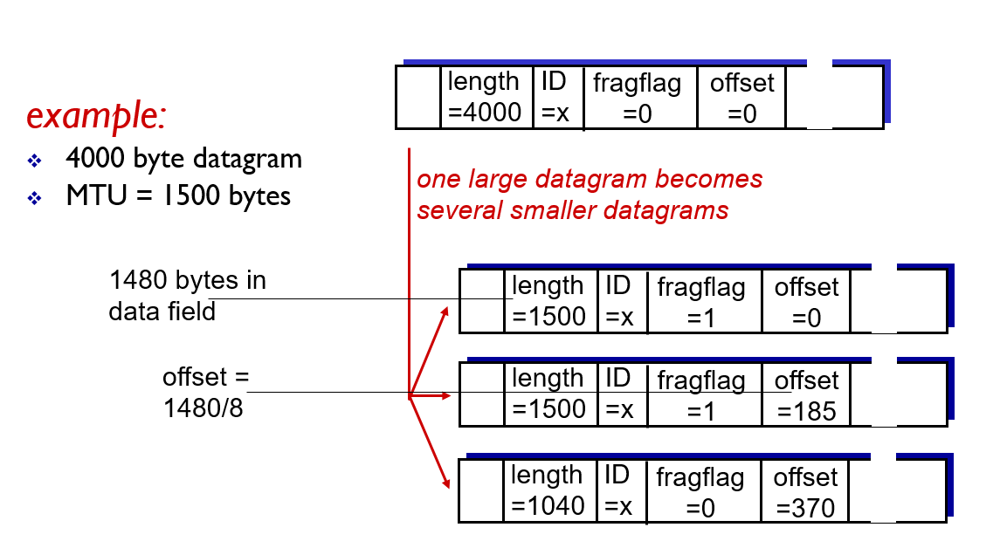
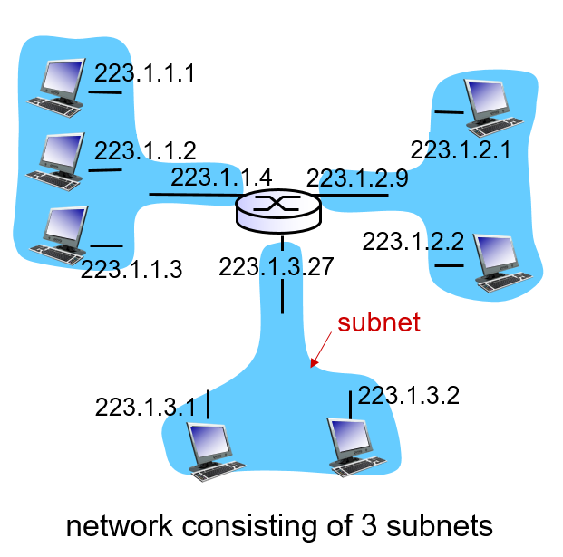

<!-- omit in toc -->
## 목차
- [1. 강좌 목표](#1-강좌-목표)
- [2. Data Plane](#2-data-plane)
  - [2.1 Input Port](#21-input-port)
  - [2.2 Switching fabric](#22-switching-fabric)
    - [2.2.1 Memory](#221-memory)
    - [2.2.2 Bus](#222-bus)
  - [2.3 Output Port](#23-output-port)
- [3. IP : Internet Protocol](#3-ip--internet-protocol)
  - [3.1 IP Fragmentation](#31-ip-fragmentation)
  - [3.2 IPv4 addressing](#32-ipv4-addressing)
  - [3.3 Subnet](#33-subnet)

## 1. 강좌 목표
- data plane을 구성하는 input & output port, high-seed switching fabric의 역할
- IP header의 format과 IP fragmentation의 과정

## 2. Data Plane

- Routing = 경로의 계산 과정
- Forwarding = routing 정보 토대로 data를 넘기는 과정
- **Control Plane**에서는 routing에 필요한 정보의 교환이 이루어진다. 
- **Data Plane**에서는 사용자가 전송하려는 data의 교환이 이루어진다.
- 상대적으로 Data Plane에서 높은 속도를 필요로 해서 일반적으로 Control Plane은 software, Data Plane은 hardware로 구현.

### 2.1 Input Port

1. Physical Layer의 역할을 하는 Line termination. Bit를 모아 frame을 형성.
2. Link Layer의 역할을 수행. 
3. Forwarding Table을 lookup하여 해당 data를 내보낼 적절한 Output Port를 찾고 forwarding 해준다
- switch fabric으로의 transmission rate이 input port로 data가 들어오는 rate보다 느리면 buffer에 데이터가 쌓이게 된다. 
- 목표: data가 들어오는 속도와 근접하게 data를 transmit하는 것을 목표로 한다. (최적화)
### 2.2 Switching fabric

- input port의 data가 outport로 전송되는 수단.
- 가상의 회선들이 여러 input과 output port들을 연결하고 있는 것을 fabric에 비유한 것. 
- input port의 buffer에 queuing delay가 심해지면 loss가 생길 수 있다 -> transmission rate을 올려야 한다.
- ?transmission rate을 떨어뜨리는 요소? -> HOL blocking
- **HOL(Head-of-line) blocking**은 switching fabric이 하나의 output port로 한번에 하나의 data만 보낼 수 있어 delay가 생기는 것이다.
#### 2.2.1 Memory
- 가장 simple하고 가장 오래된 타입. CPU의 제어하에 switching이 이루어지는 것이 특징이다.
- CPU의 memory로 data가 복사되면 CPU가 dest 주소를 추출해 routing table에서 적절한 output port를 찾는다.
- 검색이 끝나면 output port로 복사를 함
- 복사 과정에서 system bus를 2번 거친다. 따라서 memory의 bandwidth가 속도를 결정하게 된다.
#### 2.2.2 Bus
- memory bandwidth의 영향을 받지 않기 위해 만들어짐. 
- CPU의 memory로 가는 system bus를 통하지 않고 data가 공유된 bus를 통해 output port로 **direct**로 전달된다.
- 하지만...한 번에 하나의 packet만 bus를 통과할 수 있어 여러 input port를 통해 동시에 data가 도착하면 block이 생긴다. 
- 따라서 bus는 bus speed가 속도를 결정하게 된다. 
- #### 2.2.3 Crossbar
- multiprocessor 내의 processor들을 상호 연결하던 방식에서 착안한 것
- 이 방법을 통해 single, shared bus의 bandwidth에 속도의 제약을 받는 문제를 해결할 수 있다. 
- N개의 input port와 N개의 output port를 2N개의 bus를 이용해 연결하는 것이 핵심.
- datagram을 fixed length로 fragmenting하는 방식으로 발전. datagram의 길이가 일정하면 최적화를 구현하기가 쉬워지기 때문
### 2.3 Output Port

- Input Port의 구조를 거꾸로 해놓은 것.
- 이 구조가 자연스러운 이유는 데이터가 input port에서 Physical -> Link -> Network Layer를 거쳤기 때문에 그 반대 과정으로 physical layer까지 내려가야하기 때문.
- Switching Fabric이 **어디로** data를 보낼지 결정했다면 output port는 **어떤** data를 **먼저** 보낼지 결정한다.
- first come first out이 기본이지만 프리미엄 서비스 사용자의 data가 우선적으로 전송되게 할 수도 있다.
- queuing으로 인한 delay와 loss가 발생할 수 있기 때문에 buffer의 크기를 잘 설정하는 것이 중요하다. 

- **Rule Of Thumb** : C는 link의 data rate이다. 즉, 전송 속도가 10Gb/s인 router는 RTT가 250ms라면 최대 2.5Gb 크기의 data가 떠돌 수 있기 때문에 초기엔 buffer의 크기를 RTT * C로 구했다. 하지만 이렇게 사이즈가 큰 buffer는 느린 DRAM으로 구현해야했다. 
- n개의 flow가 존재하면 multiplexing이 일어나면서 전송이 부드러워(?)지기 때문에 buffer의 크기를 줄여도 된다고 한다.
- 만약 위의 예시에서 50000개의 flow가 존재한다면 buffer의 크기가 10Mb로 줄어들고 훨씬 빠른 SRAM으로도 구현할 수 있게 된다.
## 3. IP : Internet Protocol

- IP datagram의 format은 20byte의 고정헤더와 가변적인 option 부분으로 구성.
- ver : IP 주소의 버젼 (ex: IPv4)
- head len : 가변적인 부분이 있기 때문에 header의 길이를 명시. 어디까지가 header인지 알 수 있게
- type of service : 필요로 하는 서비스의 type을 적는 칸. 실제로는 안 쓰인다고 함.
- length : 전체 datagram의 길이
- TTL(Time To Live) : # of remaining hops. router 하나 지날 때마다 줄어든다.
- upper layer : TCP 인지 UDP인지 명시
- header checksum : error check
- option : 거쳐간 router의 IP 주소를 stamp해 route 기록 가능.
- TCP + IP : 고정 40 바이트가 header로 사용된다.
### 3.1 IP Fragmentation
- Network Link는 MTU(Maximum Transmission Unit)가 존재. link마다 그 값은 차이가 난다.
- 따라서 datagram을 MTU에 맞추어 조각으로 나누는 과정이 일어난다.
- 각 조각에는 원래 datagram의 header가 복사되고 특정 정보가 추가된다.
- 조각의 합체는 destination에 도착했을 때 일어난다.

- 16-bit identifier : 원래 datagram의 id를 명시. 조각들이 같은 source에서 나온 것인지 확인하기 위해
- flag : 마지막 조각인지 확인하기 위한 값. 마지막 조각이면 0 아니면 1이 들어감.
- fragment offset : 이 조각에는 원래 datagram의 어떤 위치부터의 내용이 실린 것인지 적혀있다. 첫 번째 조각에 800 byte의 data field가 실려있다면 두 번째 조각의 offset에는 800/8 = 100 이 실린다.
- 4000 = 3980(data-feild) + 20(header-field)
- 1500 = 1480(data-field) + 20(header-field)
- 1040 = 1020(data-field) + 20(header-field)
  
- 3980 = 1480*2 + 1020
- 4000 < 1500*2 + 1040 = 4040

### 3.2 IPv4 addressing
- 32 bit이다. 8bit 씩 끊어서 10진법으로 표현해 4개의 숫자로 표현.
- IP 주소는 하나의 interface마다 할당된다. interface는 host/router와 physical link간의 연결을 뜻한다.
- 하나의 host/router가 여러 interface를 가질 수 있으므로 여러 IP 주소가 할당될 수 있다.
  
### 3.3 Subnet

- CIDR: IP 주소는 subnet을 구분하는 파트와 host를 구분하는 파트로 나뉜다. 
- router를 거치지 않고 통신을 할 수 있는 애들을 묶은 것이 Subnet이다.
- 주소 뒤에 subnet mask를 붙여 subnet 파트의 길이를 알려준다. 
- ex) 223.1.3.0/24 는 223.1.3 까지가 subnet 파트고 0이 host 파트이다.
- subnet 파트가 24bit이면 host part가 8bit이기 때문에 최대 256명의 host만 구분이 가능하다.
- 반대로 subnet 파트가 8 bit이면 2^16 host를 구분할 수 있는데 이는 지나치게 큰 숫자이기 때문에 16bit가 가장 많이 쓰인다고 한다.
