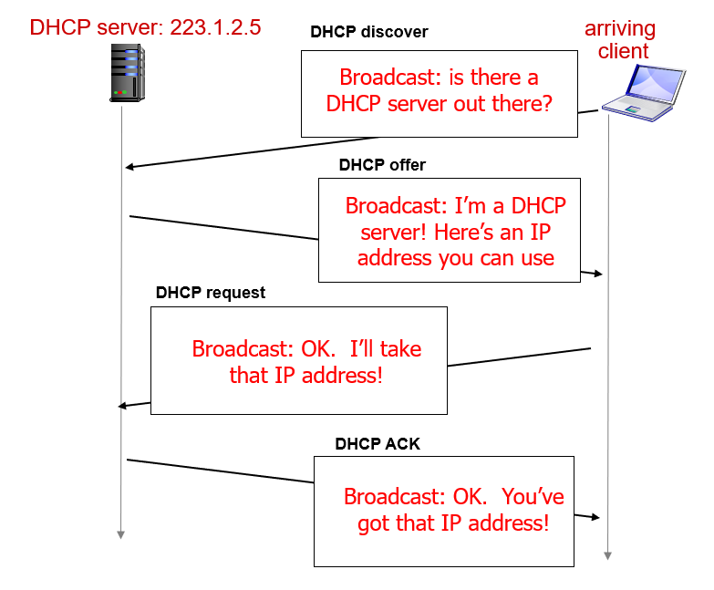
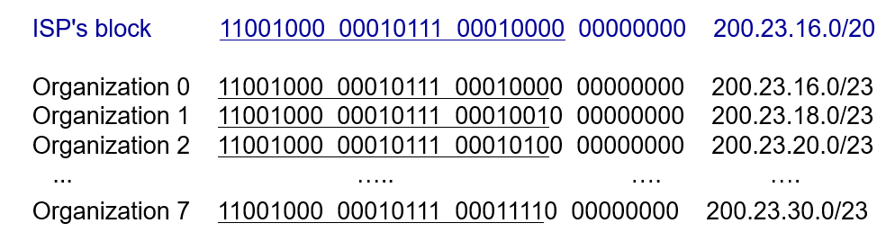
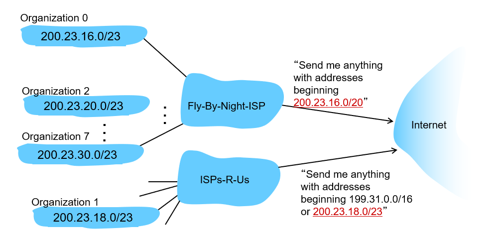
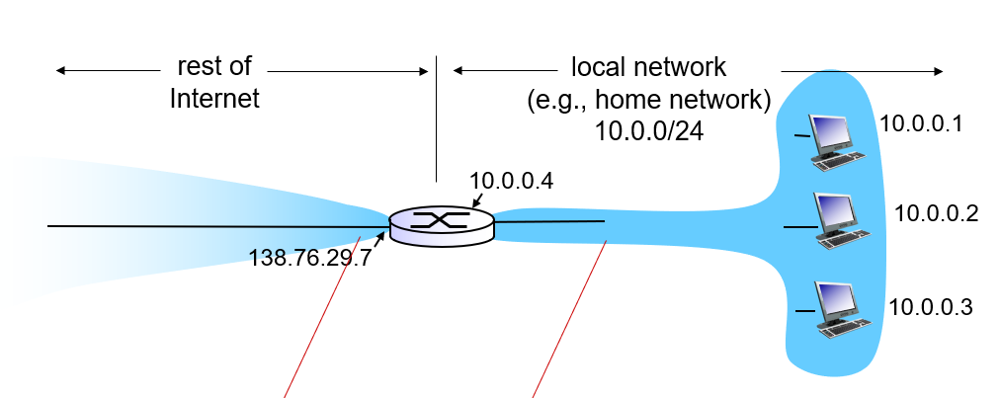
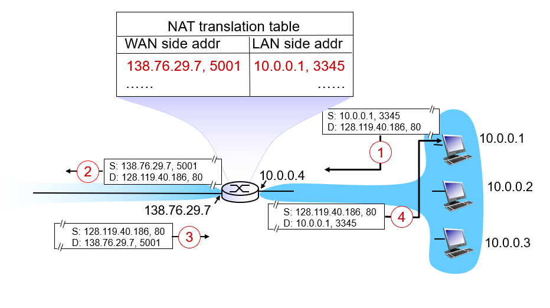

## 목차
- [목차](#목차)
- [1. DHCP: Dynamic Host Configuration Protocol](#1-dhcp-dynamic-host-configuration-protocol)
  - [implementation](#implementation)
- [Subnet](#subnet)
- [NAT: network address translation](#nat-network-address-translation)
  - [implementation](#implementation-1)
  - [UPMP](#upmp)

## 1. DHCP: Dynamic Host Configuration Protocol

**다이나믹하게 그때 그때 IP 주소를 할당받는다.**

* client server protocol을 따른다. 
* goal:

    네트워크에 들어와 있을 때만 IP 주소를 할당 -> 주소 재사용이 가능 효율성 up
    특히 모바일 유저의 경우 subnet에 들어갈 때 ip 주소를 할당하는 게 매우 효율적

1. host broadcast "DHCP discover" optional  
   * 0.0.0.0 나의 ip 주소가 정해지지 않았을 때
   * dest: 그 subnet을 의미하는 broadcast 67번 포트 번호 사용
2. DHCP server respond with "DHCP offer" optional
3. host request IP address
4. DHCP server sends address

4개의 메세지 모두 transaction ID를 가진다.-> 어떤 메세지에 대한 응답인지를 확인할 수 있게 됨

추가적으로 DHCP가 제공하는 정보
1. address of first hop router for client 
2. name and IP address of DNS server 상대방의 ip 주소를 알기 위해
3. network mask subnet portion이 얼만큼인지
   
### implementation
1. 랩탑을 키면 자동적으로 DHCP client 구동, request 생성
2. request가 DHCP server가 있는 라우터에 가고 
3. client IP, first hop address, name and address of dns server  포함한 DHCP ack 메세지를 DHCP 서버가 전송, 내려갈 때 다시  encapsulation
4. 랩탑은 아이피 주소를 얻게 됨

## Subnet

* Q: 서브넷은 어떻게 아이피 주소를 얻게 되는 건지?
  
    >A: isp로부터 주소블록을 할당받게 됨

ISP들은 인터넷에 연결할 때 자기가 연결하고 있는 각각의 아이피 주소를 다 인터넷에 알리는 것이 아니라 isp block에 해당하는 것은 모두 나에게 보내라고 advertisement를 한다. 인터넷은 자세한 정보 *긴 prefix*부터 forwarding

* isp를 변경하게 되었을 때
  
    클라이언트의 아이피 주소를 모두 변경하는 것이 아니라 isp에서 인터넷에 advertisement 할 때 추가적으로 얘도 나한테 줘라고 한다.

* 먼 목적지일수록 aggregate이 많이 일어날 수 있으므로 짧은 prefix를 가진다.

* Q: isp는 누구로부터 prefix를 할당받는것인지?
  
    >A: .kr에 대해서 한국 인터넷정보센터에서 isp에 ip주소블록 할당, 국가의 전반적인 dns 관리

## NAT: network address translation

NAT 역시 ip 주소를 절약하기 위해 사용

* subnet 전체가 하나의 ip 주소를 사용해서 네트워크 접속 가능 
* subnet 내에서는 local subnet에서 자체적으로 할당한 ip 주소 사용(=사설 ip) 사용

* 장점
  * 로컬 네트워크 내의 ip 주소 변경이 자유롭다
  * isp를 변경해도 사설 ip 주소에는 영향을 미치지 않는다.
  * 로컬의 각각의 디바이스가 외부에서는 invisible하기 때문에 보안 good

### implementation

NAT router:
* 디바이스에서 사설 ip 적어서 내보낸 데이타그램을 받아서 **사설 ip 주소-> nat 라우터 주소**로, **port 번호->NAT router에서 할당한 포트 번호**로  새롭게 변경
* NAT translation table에 (source ip와 포트 번호) (새 포트 번호 nat 라우터 주소) 매핑 정보를 기억 
* 정보가 들어오면 다시 원래대로 변경해서 로컬 디바이스에 데이터 전달

16bit port number field-> 60000개 정도의 single LAN side 연결 가능

* 단점
  * 원래 네트워크 계층의 헤더까지 관리하는 라우터에서 transport의 헤더를 건드려야 한다는 점
  * 외부에 ip 주소가 알려지지 않는다. 로컬에 서버가 있을 경우에는?
    >NAT translation table을 볼 수 있으면 서버 ip를 클라이언트가 아는 것이 가능하지만 nat로컬에 있는 서버에서 밖으로 데이터를 한 번 내보내야 한다.

    >> solution 1   
    관리자가 미리 수동으로 nat translation table를 매핑해놓는다
    >> solution 2   
    upmp 자동적으로 nat translation table 설정을 해주는 프로토콜 

### UPMP
서버 프로세스가 탄생하면 upmp를 통해 nat router의 public ip 파악, 자신에게 할당되는 새로운 포드 번호를 lease 해달라는 요청을 보낸다. -> NAT TRANSLATION TABLE 생성 가능