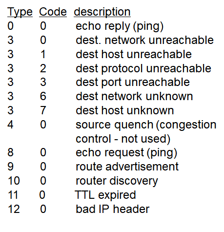
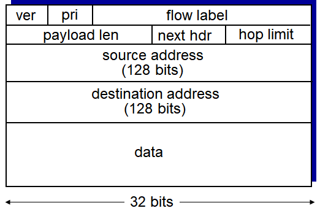
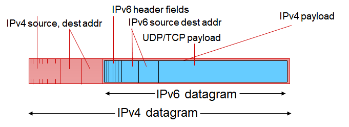
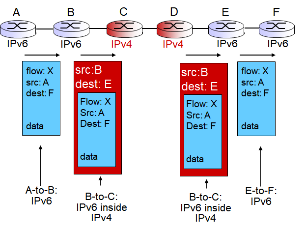

## 목차
- [목차](#목차)
- [1. ICMP: internet control message protocol](#1-icmp-internet-control-message-protocol)
  - [icmp 메세지](#icmp-메세지)
  - [Traceroute](#traceroute)
- [2. IPv6](#2-ipv6)
  - [2-1. router의 packet processing speed up](#2-1-router의-packet-processing-speed-up)
  - [2-2. Quality of Service (QOP)](#2-2-quality-of-service-qop)
  - [2-3. Other changes](#2-3-other-changes)
  - [어떻게 IPv6 라우터를 퍼뜨릴까](#어떻게-ipv6-라우터를-퍼뜨릴까)
- [3. Routing Protocol](#3-routing-protocol)
  - [routing algorithm](#routing-algorithm)
    - [global(link state algorithm):](#globallink-state-algorithm)
    - [decentralized (distance vector algorithm):](#decentralized-distance-vector-algorithm)
    - [static:](#static)
    - [dynamic :](#dynamic-)

네트워크 계층 프로토콜 3개 

IP ICMP Routing Protocol

## 1. ICMP: internet control message protocol
* error reporting
* 서로 살아있는지 정보를 교환

icmp 메세지가 인터넷을 통해 다른 호스트한테 전달될 때 ip의 payload에 icmp 메세지가 담기게 된다.(encapsulate 된다)

### icmp 메세지

* type-error type
* code-error code
* error 나서 전달 못하는 datagram의 첫 8바이트
  

* 8 0 ping message -> pong message 로 응답
* TTL(time to live) 0이 되면 라우터는 데이타그램 버리고 소스 호스트에 버렸다고 icmp message로 보고
* checksum 헤더 오류가 있으면 있으면 소스 호스트에 bad header icmp message를 보낸다.
* source quench: congetion control을 위한 거였는데 인터넷은 라우터가 congestion control하지 않아서 정의되긴 했지만 실제로 사용되진 않는다.

### Traceroute

route 파악을 위한 프로그램

1. udp segment 3개씩 한 1set이고 n 번째 set에 n TTL 부여
2. n번째 라우터에서 드랍 하면서 icmp 메세지를 보냄(type code 11 0) 소스 주소= n번째 라우터 주소, destination 주소= 소스 호스트 -> n번째 라우터의 이름을 알 수 있음 
3. udp 포트 번호를 이상한 번호를 넣어놓고 목적지 호스트에서 "port unreachable" 메세지(type code 3 3) icmp 메세지를 보내게 되면 경로 파악 끝났다고 파악하고 그만 보낸다.

## 2. IPv6
> IPv4: 32 비트로 표현할 수 있는 주소가 한정적,
> 
> CIDR, DHCP, NAT 등의 프로토콜 개발해서 주소 절약 
헤더 필드 길이가 고정적이지 않았다.(option bit 때문에)

IPv6: 주소표현에 128 비트 사용

### 2-1. router의 packet processing speed up
> router to router의 이동시간이 짧아지면서 라우터 자체의 processing 속도가 통신 속도를 결정하게 되었다.

1. 하드웨어로 packet processing 처리-> 헤더 길이가 고정적이어야 함-> 40바이트로 고정

2. option bit를 없앴다 -> option bit 역할을 할 optional header가 필요
   * next header 필드에서 다음에 오는 optional header가 어떤 종류인지 표시
   * 마지막 헤더의 next header 필드는 udp인지 tcp인지 나타낸다. ->upper layer라는 필드는 사라지게 됨 udp tcp로 할지 결정하기 위한 필드였기 때문
   * 모든 optional header는 다음 optional header를 표시하는 next header 필드를 가진다. -> optional header 여러 개 올 수 있다.
  
3. no fragmentation allowed => souce host에서 fragmentation 후 다시 전달
   * 라우터가 받기에 너무 큰 datagram 4에서는 fragmentation했는데 6에서는 드랍해버림 -> icmp v6가 정의되고 packet too big 이라는 테이블 추가 
   * 라우터에서 fragmentation 하던 시간 단축
  

### 2-2. Quality of Service (QOP)

QOP를 위해 헤더에 다음 필드 추가 
1. priority: datagram 우선순위 
2. flow label: 어떤 플로우에 속하는 데이타그램을 구분할 수 있도록

### 2-3. Other changes
* checksum 제거 
> 헤더에 오류가 있을 가능성이 거의 없다고 보고 라우터가 체크하느 과정을 없애버렸다.

* ICMP v6 멀티캐스팅 기능을 추가(group management)

### 어떻게 IPv6 라우터를 퍼뜨릴까
tunneling

> ipv4 payload에 ipv6 데이타그램을 담는 방법

v6 라우터들끼리는 다음 v6라우터를 알 수 있다.

1. B 라우터가 IPv4로 encapsulate을 함 
   * sourch address:B의 IPV4주소  destination address: E의 IPv4 주소
2. E에 오면 헤더를 뜯어내고 보면 v6 데이타그램이 들어가있다.
3. IPv6 프로토콜을 따르는 데이타그램을 f에게 넘겨주게 된다.

## 3. Routing Protocol 
routing algorithm과 밀접한 연관이 있으므로 라우팅 알고리즘을 주로 포함 

### routing algorithm 
사용하는 정보에 따라 **global/decentralized**, **static/dynamic**으로 나뉜다.

#### global(link state algorithm):
* 각 라우터가 속한 네트워크의 정보를 모두 가지고 있는 상태에서 consistent한 정보를 가지고 경로를 짠다.

> dijkstra's algorithm:
> 
> 한 소스 호스트에 대해서 그 네트워크에 있는 자기자신을 제외한 모든 노드들에 대해서 가장 가까운 데스티네이션부터 가장 짧은 루트를 계산
 
#### decentralized (distance vector algorithm): 
* 자기 바로 옆의 링크와 그 cost만 알고 있는 상태에서 neighbor들끼리 자기의 neighbor와 cost를 공유->라우터들이 다른 라우터에 가기 위한 cost를 모두 알 수 있게 된다.

#### static: 
* link cost가 static
  > ex) link 길이를 가지고 cost를 정할 때, 링크가 있으면 1, 없으면 무한대로 놓는 경우 
    * 알고리즘에 주어지는 정보가 static이라 계속 실행할 필요가 없음
#### dynamic :
* link cost를 계속 조사해서 알고리즘에 넣어 그때 그때 최적의 경로 탐색
  > quality보장해야 하는 경우에 많이 쓰인다.
  >
  > 정보를 계속 교환해야 하므로 오버헤드가 커져서 실시간으로 계속 실행하는 대신 주기적으로 실행하는 방법도 있다.
