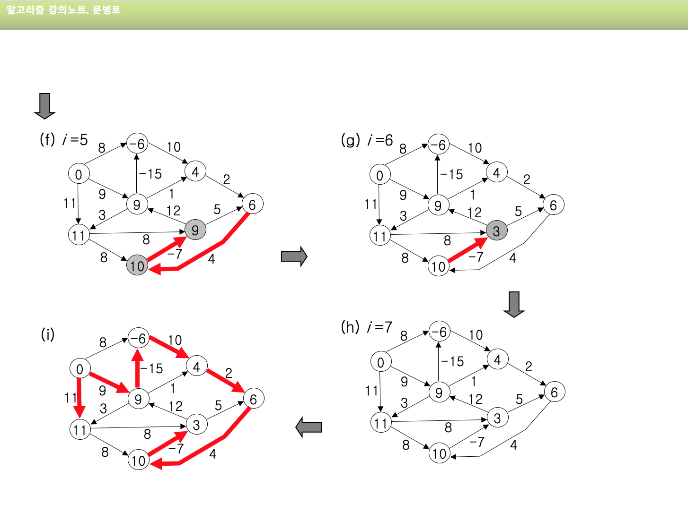

## 목차
- [목차](#목차)
- [1. 강좌 목표](#1-강좌-목표)
- [2. Link State Routing Algorithm](#2-link-state-routing-algorithm)
  - [2-1. 다익스크라 알고리즘(Dijkstra Algorithm)](#2-1-다익스크라-알고리즘dijkstra-algorithm)
- [3. Distance Vector Algorithm](#3-distance-vector-algorithm)
  - [3-1. Bellman-Ford equation(dynamic Programming)](#3-1-bellman-ford-equationdynamic-programming)
- [4. Comparison of LS and DV algorithms변](#4-comparison-of-ls-and-dv-algorithms변)

## 1. 강좌 목표 
  - 하나의 시작 정점에서 다른 모든 정점까지 가는 최단경로 
  - Dijkstra algorithm의 작동원리와 코드를 이해한다.
  - Bellman-Ford algorithm의 작동원리와 코드를 이해한다. 

## 2. Link State Routing Algorithm
  **shortest path**
    - 간선 가중치가 있는 유향 그래프 (cf. 무향그래프 - 양쪽으로 유향 간선이 있는 그래프)
    - 두 정점 사이의 경로들 중 간선의 가중치 합이 최소인 경로 
  
  - 기본적인 최단경로문제(shortest path problem) 유형
     1. single source and single destination
     2. single source - 사이클이 없는 그래프의 최단경로 
        1. dijkstra - 음의 가중치를 허용하지 않는 최단경로
        2. bellmanford - 음의 가중치를 허용하는 최단경로 
     3. single destination 
     4. all pairs
   
### 2-1. 다익스크라 알고리즘(Dijkstra Algorithm)
  - 음의 가중치를 허용하지 않는다. 
    - 그래프 G=(V, E)에서 간선들의 가중치가 모두 0 이상인 경우
  - single source shortest path problem
    - 하나의 node('source')에서 다른 모든 node들로 가는 최단 거리 
    - forwarding table 제공!  

  
  
  

  1. 시점 정점을 제외하고는 모두 무한대에 해당하는 값으로 초기화한다.  
  2. 시작 정점을 집합 S의 첫번재 원소로 추가하고, 이 정점에 연결된 정점들에 이르는 cost들을 각각 node에 기록해둔다.
  즉, 연결된 정점들 이외에는 모두 무한대의 값을 가진다.
  3. 최단거리가 가장 짧은 정점을 집합 S에 포함시킨다. 이 때 정점의 최단거리가 무한대가 아닌 수에서 update되는 것은 더 짧은 경로가 발견되었을 때 이다. 
    즉, 정점 A와 B를 연결한다는 의미는 (시작점부터 A까지의 최단 거리 + A와 B간선의 가중치)  vs 시작점부터 B까지의 최단거리 중 작은 값이다!

  **complexity** 
  - n nodes 
  - 각 순회할 때 마다 포함되지 않는 node들 중에서 최단거리를 가지는 node가 있는지 체크한다. 
  - n(n+1)/2 번의 비교 ->O(n^2)
    - n -> n-1 -> n-2 ... 1 
  - heap 이용 => O(ElogV) E: Edge 간선, V: vertex 정점 

## 3. Distance Vector Algorithm
  **link cost changes** 
    - node는 local link cost change를 감지한다.
    - routing info를 update하고, distance vector를 계산한다 
    - 만약 distance vector가 변동되면, 이웃 node에도 알린다.
### 3-1. Bellman-Ford equation(dynamic Programming)
  - 음의 가중치를 허용한다 
    -  그래프 G=(V, E)에서 간선들의 가중치가 모두 0 이상인 경우
  - 하나의 node('source')에서 다른 모든 node들로 가는 최단 거리 
    - forwarding table 제공! 
  
  
  
 
  1. 시작 정점 r 의 최단거리는 0이 되고 나머지 정점들은 무한대가 된다. 
  2. for 문을 한 번 돌고나면, 간선 하나를 사용해서 r부터 도달할 수 있는 최단경로가 계산된다. (r에 인접한 node들) 즉, 앞에서 설정한 최단 거리가 더 짧아질 수 있도록 변동한다. 무한대에서 값으로 update되거나 혹은 값에서 더 작은 값으로 변동된다. 
  3. n-1번의 반복을 통해서 n-1개의 간선을 사용해서 이를 수 있는 최단 경로가 만들어진다. -> 이것이 최종 최단 경로가 된다. 
  
## 4. Comparison of LS and DV algorithms변
  - message complexity 
    - LS: V nodes & E links => O(VE)
    - DV: 이웃들 사이에서 교환 -> 시간 상이

  - convergence 속도 
    - LS: O(n^2) algorithm은 O(VE) msg 필요
    - DV: 시간 상이 -> routing loop & count-to-infinity 문제 

  - robustness: router가 잘못 작동한다면? 
    - LS: node가 잘못된 link cost를 가질 수 있다. 
          - 각 node는 자신의 table만 계산한다 
    - DV: node는 잘못된 path cost를 가질 수 있다.
          - 각 node의 table은 다른 node들에 의해서 사용된다. 
  

