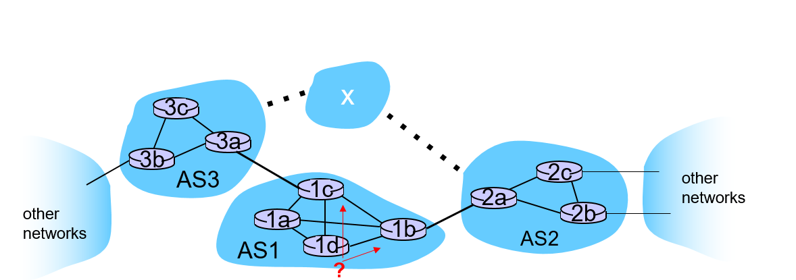
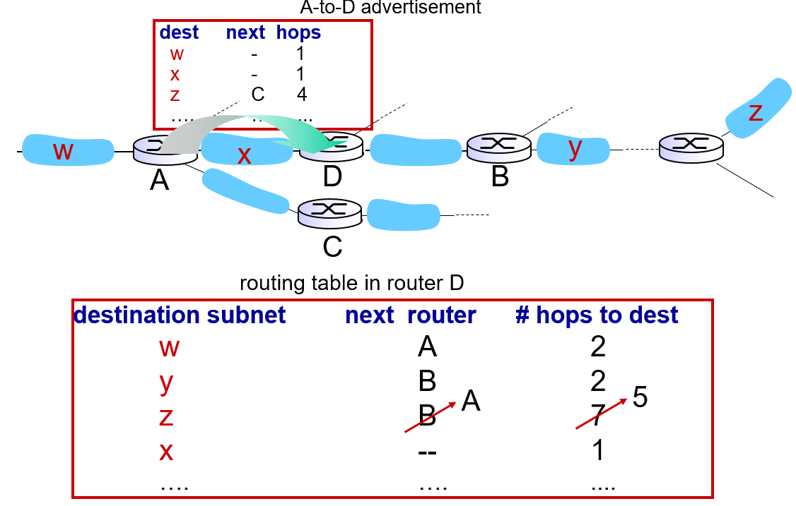
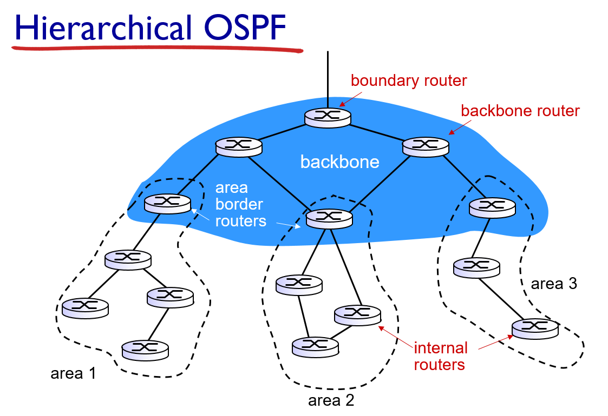
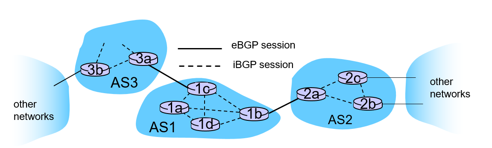

<!-- omit in toc -->
## 목차
- [1. 강좌 목표](#1-강좌-목표)
- [2. Hierarchical routing](#2-hierarchical-routing)
  - [2.1 Route Inside AS](#21-route-inside-as)
  - [2.2 Route Outside AS](#22-route-outside-as)
- [3. Routing in the Internet](#3-routing-in-the-internet)
  - [3.1 Intra-AS Routing Protocol](#31-intra-as-routing-protocol)
    - [3.1.1 RIP (Routing Information Protocol)](#311-rip-routing-information-protocol)
    - [3.1.2 OSPF (Open Shortest Path First)](#312-ospf-open-shortest-path-first)
    - [3.1.3 Hierarchical OSPF](#313-hierarchical-ospf)
  - [3.2 Inter-As Routing Protocol](#32-inter-as-routing-protocol)

## 1. 강좌 목표
- Inter-AS 와 Intra-AS routing protocol의 종류와 작동 방법에 대해서 알아본다. 

## 2. Hierarchical routing
- AS(Autonomous System) : 동일한 관리자에 의해 동일한 정책을 통해 관리되는 라우터들과 subnet의 집합. 영역(domain)과 같은 의미로 사용이 된다. 
- 사용 이유 : 라우팅 정책의 독립성, 보안 유지, 오류의 국지화, 트랙픽량의 최소화.
- 다른 AS의 router와 연결되는 router를 특별히 gateway router, border router라고 부른다
### 2.1 Route Inside AS
- Intra-AS routing protocol을 사용해 AS 내의 router끼리 정보를 교환하며 forwrarding table을 작성하고 최소 distance의 route를 검색한다. 
### 2.2 Route Outside AS

- 목표 : router 1d에서 AS X에 있는 라우터에 접근하고 싶다.
- inter-AS routing protocol을 사용해 reachable한 AS에 대한 정보를 받아온다. 예시에서의 경우 AS1은 AS3, AS2에 접근이 가능하고 두 라우터를 거쳐 AS x에도 접근이 가능하다. 이 정보를 AS1 내의 모든 라우터에게 뿌려준다.
- AS1에 속하는 라우터 1D가 AS X로 정보를 보내고 싶다고 한다. inter-AS protocol로부터 뿌려진 정보를 통해 AS2를 거치거나 AS3를 거치는 route가 있음을 확인한다. 이제 어떤 route를 선택할지 선택.
- 선택의 기준은 **hot potato routing**. 각 루트에서 사용하는 gateway router까지의 거리가 더 짧은 루트를 선택. 최종적으로는 distance가 더 길더라도 나의 AS를 최대한 빠르게 빠져나가게 하기 위한 선택. 이 루트는 2.1에서 설명한 Intra-AS protocol 사용.

## 3. Routing in the Internet
### 3.1 Intra-AS Routing Protocol
#### 3.1.1 RIP (Routing Information Protocol)

- Distance Vector 알고리즘에 기초하여 개발됨. 소규모 혹은 교육용과 같이 간단한 네트워크에 사용됨.
- 특징 
  1. 모든 링크의 값을 1이라고 가정. 즉, 경로비용을 속도나 거리, 지연 등을 무시하고 hop의 count로만 판단. => 최적 경로 산정에는 비효율적.
  2. 최대 hop count를 15로 제한. hop count 16은 무한대를 의미. 16 hop 이상 떨어진 곳으로는 정보 전달 불가능.
  3. Advertisement(response message)에 DV를 실어서 30초마다 이웃과 교환. 목적지의 개수가 25개로 제한.
- Link Failure가 발생하면? Link Failure는 180초 동안 advertisement가 도착하지 않았을 때 일어났다고 간주. 그러면 해당 router를 거치는 route를 모두 폐기하고 수정된 advertisement를 이웃에게 전달. 그럼 그 이웃들도 자신의 route를 수정해 reply. Infinite loop를 막기 위해 poison reverse 사용. 
- RIP routing table은 route-d라는 application-level process가 담당. 30초마다 ad message 만들어서 UDP로 보내고 background에서 계속 작동 중인 상태.
  

#### 3.1.2 OSPF (Open Shortest Path First)
- RIP와 달리 Link State 알고리즘(Dijkstra)에 기초하여 개발됨. RIP가 대규모 네트워크에 부적합해서 개발됨. 
- RIP는 30초마다 ad message를 보냈는데 OSPF는 네트워크가 안정되면 링크 상태가 변화할 때만 라우팅 정보를 전송한다. 
- RIP는 hop count로 경로비용을 계산하였지만 OSPF는 link cost의 정의가 가능하다. 여러개도 정의 할 수 있어 cost 종류 별 table을 따로 계산하는 것도 가능하다.
- Network 전체에 정보가 뿌려진다는 차이점.
- Multiple same-cost path를 사용가능하다.
- IP의 바로 위에 구현되어 UDP, TCP encapsulation이 불가하다.
  
#### 3.1.3 Hierarchical OSPF

- AS 내부에 영역(Area)라는 개념을 두어 backbone area-그냥 area의 2-level 계층 구조를 만듦.
- 이를 통해 라우터의 부담을 줄여준다. 왜냐하면 정보를 주고받는 Node, Link의 수가 증가하면 packet flow가 증가하기 때문이다. Area의 크기를 제한하고 Link state의 broadcasting을 Area 내부로 제한해 packet flow의 크기도 제한한 것이다.
- 모든 영역은 backbone 영역과 area border router를 통해 연결되어 있다. backbone 영역은 라우팅 정보를 그냥 영역으로부터 수집하고 분배시켜주는 역할을 한다. 

### 3.2 Inter-As Routing Protocol
- Intra-AS Routing Protocol은 하나의 AS 안에서 사용하는 것이므로 AS 별로 다른 protocol을 사용해도 상관이 없다. Inter-AS Routing Protocol은 서로 다른 AS끼리 통신을 하는데 사용하는 것이기 때문에 하나로 통일을 해야한다.
- 현재는 BGP (Border Gateway Protocol)이 사용된다. 

- 특징:
  
  1. 발전된 형태의 Distance Vector Routing Protocol을 사용한다. 'Path Vetor Routing Protocol'이라고 부름. 이것은 looping을 방지하며 목적지에 도달하는 경로를 찾는 것을 목표로 한다. 따라서 최적의 경로가 아닌 도달 가능성을 알리는 프로토콜
  2. eBGP : 이웃 AS를 통해 도달 가능성을 찾는 protocol
  3. iBGP : eBGP로 계산한 도달 가능성을 AS 내부에 뿌리는 protocol
  4. 거리가 아닌 policy, security를 가장 중요시 한다.
  5. 신뢰할 만한 TCP 연결이 이루어진 후에야 정보의 생성/전달이 이루어진다.
- Path Attribute : 목적지 AS 까지의 경로에 관련된 정보들을 나타내는 매개변수. 이 속성들을 사용해 경로를 선정한다
  
  1. AS-PATH : 경유하는 AS의 번호들. 갯수가 작을수록 짧은 경로로 판단.
  2. Next-Hop : 다음 Hop AS에서 무조건 거쳐야하는 router의 IP 주소. 다음 AS로 가는 경로가 여러개 존재 가능하기 때문에.

- route advertisement를 받아들이는 gateway router는 import policy를 사용해 ad를 받을지말지 결정한다. 
- 경로는 policy - AS 개수 - hot potato(closest NEXT-HOP
- BGP Message
  
  1. OPEN : 처음 TCP Connention 요청하는 message
  2. KEEPALIVE : OPEN에 대한 ACK인 동시에 네트워크에 변화가 없어 주고받는 정보가 없을 때 60초마다 보내 자신이 살아있음을 알리는 메시지.
  3. UPDATE : 네트워크에 변화가 생기면 새 경로 업데이트
  4. NOTIFICATION : error report 혹은 connection 종료.