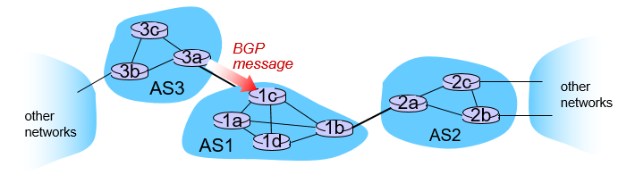
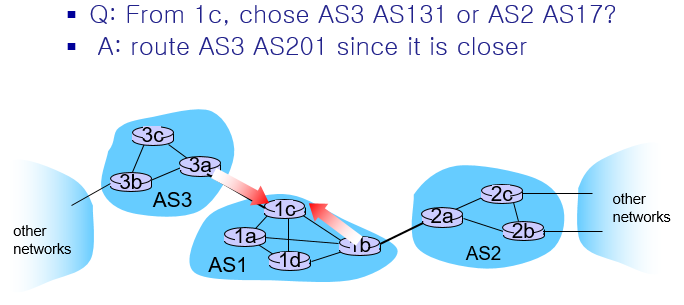
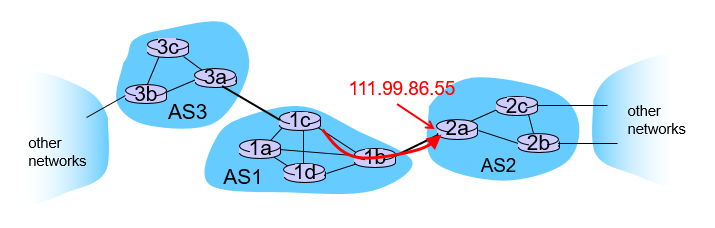
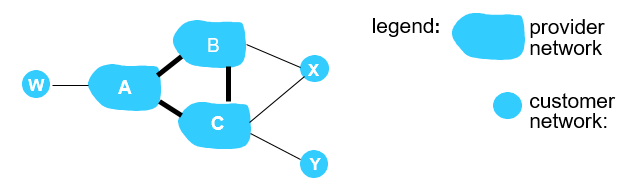
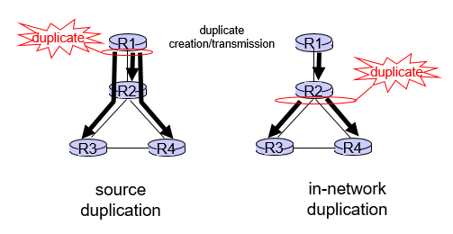

<!-- omit in toc -->
## 목차
- [1. Putting it all together](#1-putting-it-all-together)
- [2. BGP routing policy](#2-bgp-routing-policy)
- [3. Intra-AS vs Inter-AS](#3-intra-as-vs-inter-as)
- [4. Broadcast and multicast routing](#4-broadcast-and-multicast-routing)
  - [4.1 Broadcast routing](#41-broadcast-routing)
    - [Flooding](#flooding)
    - [Controlled flooding](#controlled-flooding)
    - [Spanning tree](#spanning-tree)
  - [4.2 Multicast routing](#42-multicast-routing)
    - [Approach](#approach)
    - [Center-based tree](#center-based-tree)
    - [Source-based tree](#source-based-tree)

## 1. Putting it all together
- BGP(inter-AS routing protocol)와 OSPF(intra-)가 협력해서 다른 AS에 있는 목적지 subnet에 대한 forwarding table 작성방법에 대해 알아보자.
-   
- BGP message에는 **route**가 들어있다. 
  - **route**구성: prefix, AS-PATH, NEXT-HOP, ...
    - prefix: 목적지 subnet의 prefix (ex. 138.16.64/22)
    - AS-PATH: 지나가는 AS 정보들(ex. AS3 AS131)
    - NEXT-HOP: 다음 AS를 연결해주는 gateway router의 주소. 여기선 AS3 gateway 주소가 됨. (ex. 201.44.13.125)
- gateway 라우터들이 이웃 gateway로부터 route정보를 받아 iBGP를 통해 AS내부 라우터들로 전파시킨다. 
- 경우에 따라 하나의 라우터가 동일한 prefix(목적지)에 대해 여러개의 route(AS-PATH)를 받는 경우도 있다. -> 그 중에 하나 선택
  - Policy를 먼저 고려한다. BGP 프로토콜에 의한. 
  - 만약 같다면 그 다음엔 AS-PATH가 더 짧은 경로를 선택한다. 
  - 그 마저 같다면 hot-potato routing을 적용한다. -> 가장 가까운 NEXT-HOP을 가진 경로를 선택한다. 
  - 
- Forwarding entry를 어떻게 작성할까. 
  - Shortest AS-PATH를 결정하면, NEXT-HOP을 봐야한다. 
  - ex. AS-PATH: AS2 AS17, NEXT-HOP: 111.99.86.55 
  - NEXT-HOP에 가는 최단 경로는 OSPF를 이용하여 결정한다. 
  - 

## 2. BGP routing policy 
advertisement하는데 적용되는 policy. 
> 참고
> 
> BGP import policy: gateway가 이웃 gateway로부터 route advertisement를 받으면 우리 AS내로 퍼트릴지 말지 정하는 policy
> 
> Best AS path policy

- Provider -> Customer 혹은 Provider -> Provider 로 전달된 advertisement 는 다시 Provider로 전달되지 않는다.
  - X는 자신이 알게된 route정보를 B나 C로 알려주지 않는다. 
- A는 B, C에게 AW라는 AS-PATH를 알려준다. 그래야 B, C는 W의 존재를 알고 A를 거쳐 W로 가는 route를 사용하기 때문이다. 
- B는 X에게 BAW라는 AS-PATH를 알려준다. 그래야 X는 W의 존재를 알고 BA를 거쳐 W로 가는 route를 사용하기 때문이다. 
- 결론적으로 말하면, advertisement로 인해 이득이 생길때만 해준다. 

## 3. Intra-AS vs Inter-AS
|             | Intra-AS Routing                                             | Inter-AS Routing                                             |
| ----------- | ------------------------------------------------------------ | ------------------------------------------------------------ |
| Policy      | Policy 필요 없음. 성능만 신경쓰면  됨                   | Route 간 트래픽 컨트롤 등을 위해  Policy 필요           |
| Scale       | 둘 모두 hierarchical routing 을 적용하면 table size, update tarffic을 줄일 수 있음 | 둘 모두 hierarchical routing 을 적용하면 table size, update tarffic을 줄일 수 있음 |
| Performance | 성능이 가장 중요                                             | Policy에 따라 결정됨                                         |

> BGP는 distance vector 유형이다. 이웃 AS로부터 경로를 듣고 결정. Distance vector는 목적지 prefix에 대해 distance를 준다. 하지만 BGP는 어떤 경로로 가는지까지 알게 된다. distance vector를 쓸 때 routing loop가 문제가 된다. 하지만 BGP에서는 경로를 받기 때문에 문제가 안된다. 내가 포함된 경로를 받으면 이건 loop라고 생각하면 된다. 

 
## 4. Broadcast and multicast routing

- Broadcast - 한 source 에서 보내는 데이터를 한 네트워크 상 모든 destination 에서 받는 것 
- Multicast - 한 source 가 보내는 데이터를 여러 destination 에서 받는 것
- 이 두 기능은 별도의 과정 없이 uni-casting 을 통해 구현 가능. 
  - 하지만, Source 근처에서 stress 가 높아짐. 
  - 게다가 source host가 모든 목적지의 주소를 알고 있어야 한다. Not easy.
  - 만약 broadcast, multicast 를 위한 정보를 별도로 가지고 있다면, 훨씬 더 효율적으로 전달 가능할 것.
  - 이제 broadcast, multicast를 자세히 알아boza.

### 4.1 Broadcast routing
#### Flooding 
  - 라우터(node)에 들어온 정보는 모든 포트로 내보내면 된다. 
  - 무작정 내보내다보면 loop가 생겨 broadcast strom이 생기기도 한다 
  - 이를 해결하기 위해 controlled flooding이 필요하다. 
#### Controlled flooding
  - 지금까지 받은 데이터를 기억해서 처음 받은 데이터만 broadcast해주거나
  - Shortest path를 통해 들어온 데이터만 broadcast 해준다. (reverse path forwarding;RPF)
#### Spanning tree
  - Graph의 모든 node를 지나는 tree
  - 가장 효율적인 방법
  - BUT. spanning tree 그리는게 어려움 ㄷㄷ
    - 그래서 그냥 reverse path forwarding 씀. 
  - ~~이건 왜 설명해준거지~~

### 4.2 Multicast routing
uni-casting에서는 network topology만 알면 됐다. 하지만 multicasting에서는 추가적으로 목적지(membership info.)가 어디에 있는지 알아야 forwarding table을 만들 수 있다.  

#### Approach
- Source-based tree: One tree per source -> 너무 많이 그려야함. 
    - Shortest path tree
    - Reverse path forwrading
- Group-shared tree: Group uses one tree
    - Minimal spanning tree (Steiner). NP-Hard
    - **Center-based tree**: 적당히 그리는 

#### Center-based tree
- 하나의 센터 라우터가 존재해서 소스가 이 라우터에 정보를 보내면 알아서 목적지로 내보내준다. 
  - Single delivery tree shared by all
  - 인터넷은 매우 다이나믹 하기 때문에 네트워크 변화가 있을 때마다 tree를 새로 만드는건 매우 비효율적이고 힘들다. 

#### Source-based tree
- 작은 규모의 네트워크에서 사용하기 적합하다. 
