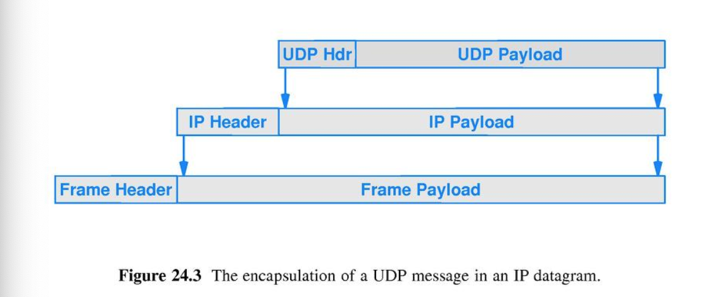
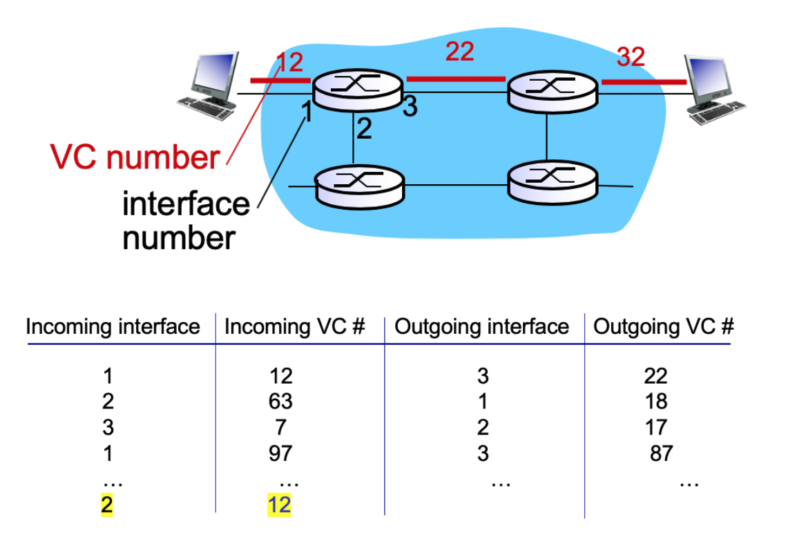

## 목차 
- [목차](#목차)
- [1. 강좌 목표](#1-강좌-목표)
- [2. Network layer(3계층)](#2-network-layer3계층)
  - [2.1 Forwarding](#21-forwarding)
  - [2.2 Routing](#22-routing)
- [3. Virtual Circuit and Datagram networks](#3-virtual-circuit-and-datagram-networks)
  - [Connection setup](#connection-setup)
  - [Connection, connection-less service](#connection-connection-less-service)
  - [3.1 Virtual-circuit Network](#31-virtual-circuit-network)
  - [3.2 Datagram Network](#32-datagram-network)

## 1. 강좌 목표 
  - network layer 계층을 이해하고, Forwarding과 Routin에 대해 안다.
  - virtual circuit과 Datagram network를 이해한다 

## 2. Network layer(3계층)
  - transport layer(4계층)의 segment를 송신 host to 수신 host로 전달한다.
  - segment를 encapsulate하여 datagram을 생성, decapsulation으로 transport layer로 배달한다. 
  - Network layer가 host와 router에서의 protocol 계층이 모두 탑재가 되도록 한다. 
  - 
      -  router는 해당 router를 통과하는 모든 IP datagram에 있는 header field를 검사한다.
      - 입력 buffer & 출력 buffer 존재  
    
### 2.1 Forwarding
  => 여행 중간의 하나의 지점을 지나는 과정
  - IP datagram이 input port로 들어올 때, 어떤 output port로 나와야 하는지 결정해서 적합한 output port로 연결시켜준다.
  - 입력 buffer로 들어온 packet의 header에 있는 IP주소와 forwarding table의 IP 주소를 비교하여 적절한 port 번호를 가진 출력 버퍼로 packet을 옮긴다. 
  
### 2.2 Routing
  => 여행의 출발지에서 목적지까지 여행을 계획하는 과정
  - source에서 destination으로 가는 route를 결정해준다
  - router에서 모든 destination에 대해서 routing algorithm으로 forwarding table을 만든다.  
  - forwarding table에 end-to-end path, 즉 목적지 IP 주소와 해당 port 번호를 저장한다. 
  - 

## 3. Virtual Circuit and Datagram networks 
  - packet switching network: 작은 블록의 packet으로 data를 전송하며, 그 동안만 네트워크 자원을 사용하도록 한다. 

   ### Connection setup 
  - datagram 전송 전, 두 개의 end hosts와 중간 router들은 virtual connection을 설립힌다. 

  - Transport-layer/Network-layer connection service 
    - Traport 계층 - 서로 다른 host에서 실행 중인 두 개의 process들 간의 logical communication을 제공한다. 
    - Network 계층 - 두 개의 host들 간의 logical communication을 제공한다. 
  
  ### Connection, connection-less service
  - **datagram Network**
    - 네트워크 계층 connectionless 서비스를 제공한다. 
    - 여러 개의 packet으로 구성된 data가 네트워크로 전달되는데, datagram 네트워크는 packet 전달 경로가 다를 수 있고, 목적지에 도착하는 packet 순서가 보내는 순서와 다를 수 있어서 목적지에서 packet의 재정렬(재조합)이 필요하다. 

  - **virtual-circuit Network** 
    - 네트워크 계층 connection-oriented 서비스를 제공한다. 

  - cf. TCP: connection-oriented, UDP: connectionless 
  - **Transport** 계층
    - Sender/Receiver process가 connectionless/connection-oriented servive를 implement한다. 
    - process to process
    - User가 TCP/UDP select 가능!    
  
  - **Network** 계층
    - router(in network core) + end system 모두 협력해서 connectionless/connection-oriented servive를 implement한다.  
    - host to host 
    - User가 Datagram/Virtual-circuit select 불가능!   
  
### 3.1 Virtual-circuit Network
   
  - call setup  -> teardown
    - 보내는 쪽에서 원하는 destination으로 vc setup을 해달라고 네트워크에 요청하기 때문에 경로가 결정된다.
    - 각 packet은 VC identifier를 지닌다.
      - VC - path + VC numbers + entries in forwarding tables 
    - 경로에 속하는 모든 router는 connection의 "state 정보" - ex) resources(bandwidth, buffers)를 저장
  - Datagram header에 destination이 아니라 link에 부여된 VC number를 적고, link가 변동될 떼, Switching된다(forwarding table에서 얻는다) 
  - **Virtual circuits: signaling protocols**
   
  - ex) ATM
  - end system이 일을 잘 하지 못하기 때문에, 중간 router들이 잘 작동해야 한다.   
  - 돈과 관련된 서비스이므로, error 최소화가 필요
  - 요즘 인터넷에서는 사용하지 않는다 

### 3.2 Datagram Network
  - call setup 없다
  - routers - end-to-end 연결에 대해서 state가 없다. 
    - network 계층의 connection은 없다. 
    - destination host address를 이용해서 packet을 forwarding한다. (VC 번호 X)
   
  - **Datagram forwarding table**
    
  - 모든 IP 주소들을 테이블로 두면, 용량도 크지만, lookup time이 길기 때문에, Destination을 address range 별로 묶어서 table에 저장한다. 
    - ex) 서울 -> 관악구 -> 봉천동 
  
  - **Longest profix matching**
  - 해당 주소에 대한 forwarding table 항목을 찾을 때, 일치하는 값들 중 가장 긴 주소 접두사를 사용한다. 
  - 즉, 예를 들어서 11001000 00010111 000110의 link interface를 찾을 때, 1번과 가장 많이 겹치기 때문에 0번이나 2번이 아니라 1번을 선택한다. 
   
  - ex) Internet 
    - 컴퓨터 사이에서 데이터를 교환한다. 
    - 많은 link 타입들이 있고, end system이 똑똑하기 때문에 중간 router가 일을 못해도 괜찮다. 
    - 무료이기 때문에 error를 네트워크가 책임지지 않는다. 
